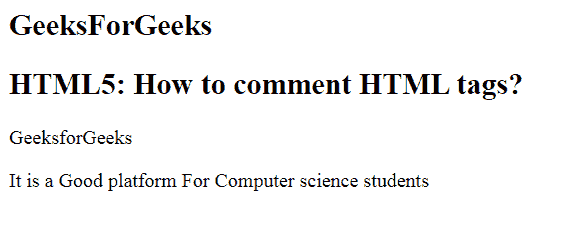

# 如何用 HTML 写评论？

> 原文:[https://www . geesforgeks . org/how-write-in-comments-html/](https://www.geeksforgeeks.org/how-to-write-comments-in-html/)

在这篇文章中，我们必须通过使用 **<来传递对一个 HTML 的评论！–注释–>**标记。这用于在 HTML 代码中插入注释。理解复杂的代码很有帮助。注释标签在代码调试期间很有用。
**语法:**

```html
<!-- Comments here -->
```

**示例:**以下代码说明了一个**单行**注释。

```html
<!DOCTYPE html>
<html>

<body>
    <h2>
        GeeksForGeeks
    </h2>
    <!-- single line comment -->

    <h2>
        HTML5: How to comment HTML tags?

    </h2>
    <!-- Paragraph element -->
    <p>GeeksforGeeks</p>
</body>

</html>
```

**输出:**


**例 2:** 以下代码说明了**多行注释**。

```html
<!DOCTYPE html>                                            
<html> 

<body> 
    <h2>
        GeeksForGeeks
    </h2>
        <!-- Multi line comment -->
    <h2>
        HTML5: How to comment HTML tags?
    </h2>

    <!-- The multi-line comment is useful 
        to comment multiple line 

        Paragraph element  -->

    <p>GeeksforGeeks </p>

    <p>
        It is a Good platform For 
        Computer science students
    </p>
</body> 

</html>
```

**输出:**
