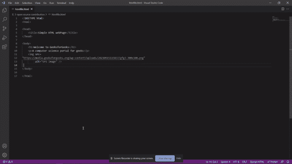

# 如何用 HTML 写邮件，用 Gmail 发？

> 原文:[https://www . geesforgeks . org/如何用 html 编写电子邮件并使用 gmail 发送/](https://www.geeksforgeeks.org/how-to-write-e-mails-in-html-and-send-it-using-gmail/)

在本文中，我们将学习用户如何用 HTML 格式编写电子邮件，并使用 Gmail 发送它们。然而，Gmail 没有提供 HTML 编辑器，我们仍然可以使用一些工具和方法在电子邮件中发送 HTML 模板。许多人需要向他人发送一封带有 HTML 模板的电子邮件。通过使用以下方法，用户将能够使用 Gmail 发送 HTML 格式的电子邮件。他们不需要使用第三方工具，如 Mailchimp 等。

使用 Gmail 发送 HTML 格式的电子邮件有 3 种方法。

1.  将网页中的 HTML 复制并粘贴到 Gmail 编辑器中。
2.  通过使用 chrome 的开发工具。
3.  通过使用 Chrome 扩展。

**方法一:** **从网页复制&粘贴 HTML 到 Gmail 编辑器**

Gmail 提供了一个“*所见即所得”*编辑器。如果我们将原始 HTML 代码粘贴到编辑器中，收件人也会看到相同的原始 HTML 代码。因此，我们不需要添加原始的 HTML，而是需要从网络浏览器中复制 HTML 代码输出，并将其传递到 Gmail 编辑器中。以下步骤将帮助您生成 HTML 格式的电子邮件。

**步骤 1:** 创建一个新的 HTML 文件，并将下面的 HTML 代码添加到其中。

## 超文本标记语言

```html
<!DOCTYPE html>
<html>

<head>
    <title>Simple HTML webPage</title>
</head>

<body>
    <h1>Welcome to GeeksforGeeks</h1>
    <p>A computer science portal for geeks</p>

     
</body>

</html>
```

**第二步:**在网页浏览器中打开 HTML 文件，从那里复制 HTML。

**第三步:**将 HTML 粘贴到 Gmail 编辑器中。



**第 4 步:**像平常一样从 Gmail 发送电子邮件。

**方法 2:** 通过使用 chrome 的开发者工具

Chrome 的开发者工具允许用户编辑网页的代码。在这里，我们将找到 Gmail 编辑器的相关元素，并向其中添加 HTML 代码。用户需要按照以下步骤来使用该方法。

**第一步:**打开 Gmail 编辑器，在编辑器内任意位置单击鼠标右键。

**步骤 2:** 从菜单中，点击*检查*选项。你会看到 chrome 的开发工具被打开，Gmail 编辑器的 HTML 代码。


**步骤 3:** 用户需要找到带有“ *contenteditable=true* ”标记的 *div* 元素。右击 div 元素，选择*编辑为 HTML* 。


**步骤 4:** 从 div 元素中移除代码，并添加您的 HTML 模板代码。


**第五步:**现在，关闭 chrome 的开发者工具，可以看到 HTML 被添加到 Gmail 编辑器中。

**方法三:使用镀铬加长件**

我们将使用 Gmail 的“ *Html 插入器”* chrome 扩展直接在 Gmail 编辑器中编写一个 Html 代码。我们只需要在 chrome 浏览器中添加一个 chrome 扩展，Gmail 就会自动显示编写 HTML 代码的选项。要实现此方法，请遵循下面的步骤。

**第一步:**从[这里](https://chrome.google.com/webstore/detail/html-inserter-for-gmail/obngoldljmnnpggbekneikaohbeflbee)将 Gmail chrome 扩展的 *Html 插入器添加到 chrome 浏览器。*

**第二步:**点击发送按钮旁边的 HTML 图标。


**第三步:**在这里添加 HTML 代码。


**第四步:**点击*插入 HTML* 按钮，我们就完成了。

**注意:**发送带有 HTML 模板的邮件时，不要添加带有外部 CSS 文件的 CSS，以及网页字体。此外，您必须在 HTML 模板中只使用在线托管和公开可用的图像。

**输出:**

以上三种方法得到的结果与下图相同。现在，用户可以像发送简单的电子邮件一样将这个 HTML 模板发送给任何人。

