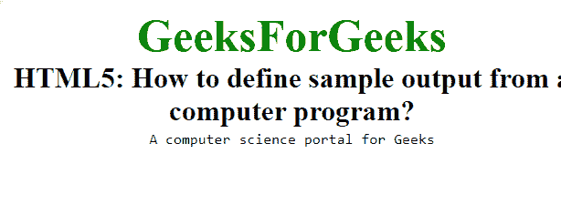

# 如何用 HTML5 编写计算机程序的输出样例？

> 原文:[https://www . geesforgeks . org/如何使用 html5 编写计算机程序输出示例/](https://www.geeksforgeeks.org/how-to-write-sample-output-of-a-computer-program-using-html5/)

在本文中，我们将通过在文档中使用 **[< samp >标记](https://www.geeksforgeeks.org/html-samp-tag/)** 来编写计算机程序的示例输出。它是一个短语标签，用于定义计算机程序的示例输出文本。

**语法:**

```html
<samp> Contents... </samp>
```

**示例:**

```html
<!DOCTYPE html>
<html>

<head>
    <title>
        Define sample output
        from a computer program
    </title>

    <style>
        body {
            text-align: center;
        }

        .gfg {
            font-size: 40px;
            font-weight: bold;
            color: green;
        }

        .geeks {
            font-size: 25px;
            font-weight: bold;
        }
    </style>
</head>

<body>
    <div class="gfg">
        GeeksForGeeks
    </div>

    <div class="geeks">
        HTML5: How to define sample
        output from a computer program?
    </div>

    <samp>
        A computer science
        portal for Geeks
    </samp>
</body>

</html>             
```

**输出:**


**支持的浏览器:**

*   谷歌 Chrome
*   微软公司出品的 web 浏览器
*   火狐浏览器
*   歌剧
*   旅行队