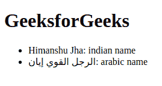

# HTML 5 <bdi>标签</bdi>

> 原文:[https://www.geeksforgeeks.org/html-5-bdi-tag/](https://www.geeksforgeeks.org/html-5-bdi-tag/)

<bdi>标签指的是双向隔离。它将文本与可能以不同方向格式化的其他文本区分开来。当用户生成的文本具有未知方向时，使用此标签。
**注意:**这个标签在 HTML5 中是新的。</bdi>

**语法:**

```html
<bdi> Contents... </bdi>
```

**示例:**以下示例说明了 bdi 标签。

## 超文本标记语言

```html
<!DOCTYPE html>
<html>
  <body>
    <!--This is heading Tag -->
    <h1>GeeksforGeeks</h1>
    <!--bdi Tag used in unordered list -->
    <ul>
      <li><bdi class="name">Himanshu Jha</bdi>: indian name</li>
      <li><bdi class="name">الرجل القوي إيان</bdi>: arabic name</li>
    </ul>
  </body>
</html>
```

**输出:**



**支持的浏览器:**

*   谷歌 Chrome
*   火狐浏览器
*   歌剧
*   旅行队