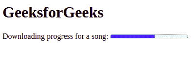

# HTML 5 `<progress>`标签

> 原文:[https://www.geeksforgeeks.org/html-5-progress-tag/](https://www.geeksforgeeks.org/html-5-progress-tag/)

它用于表示任务的进度。它还定义了完成了多少工作，还有多少剩余来下载一个东西。它不用于表示磁盘空间或相关查询。
**语法:**

```
<progress attributes...> </progress>
```

**属性:**<进度>标签包含两个属性，如下所示:

*   [**max**](https://www.geeksforgeeks.org/html-progress-max-attribute/) **:** 它代表完成一项任务需要完成的总工作量。
*   [**值**](https://www.geeksforgeeks.org/html-progress-value-attribute/) **:** 它代表已经完成的工作量。

**注意:**这个标签和 JavaScript 一起使用，显示任务的进度。它不用于测量目的。
**例:**

## 超文本标记语言

```
<!DOCTYPE html>

<html>

    <body>
        <h1>GeeksforGeeks</h1>
        Downloading progress for a song:
        <!--HTML progress tag starts here-->
        <progress value="57" max="100">
        </progress>
        <!--HTML progress tag ends here-->
    </body>

</html>                   
```

**输出:**



**支持的浏览器:**

*   谷歌 Chrome 8.0
*   Internet Explorer 10.0
*   Firefox 16.0
*   Opera 11.0
*   Safari 6.0