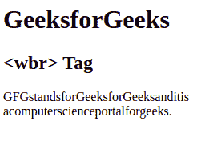

# HTML 5 <wbr>标签

> 原文:[https://www.geeksforgeeks.org/html-5-wbr-tag/](https://www.geeksforgeeks.org/html-5-wbr-tag/)

HTML 中的<wbr>标记代表断字机会，用于定义文本中被浏览器视为换行符的位置。当使用的单词太长，浏览器可能会在不适合文本的地方换行时，通常会用到它。
**语法:**

```html
<wbr>
```

**注意:**<wbr>标签在 HTML5 中是新的，不需要结束标签。
以下示例说明了 HTML 5 中的< wbr >标记:
**示例 1:**

## 超文本标记语言

```html
<!DOCTYPE html>
<html>

    <body>
        <h1>GeeksforGeeks</h1>
        <h2><wbr> Tag</h2>
        <!--  It is mostly used when the used word is too long and
              there are chances that the browser may break lines at
              the wrong place -->

<p>GFGstandsforGeeksforGeeksanditis<wbr>acomputerscienceportalforgeeks.</p>

    </body>

</html>                   
```

**输出:**



**支持的浏览器:**

*   谷歌 Chrome 1
*   Internet Explorer 12.0
*   firefox3
*   歌剧 11.7
*   Safari 4