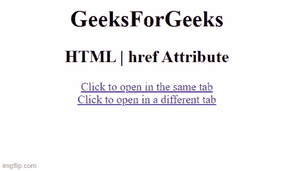

# HTML a href 属性T3】

> 原文:[https://www.geeksforgeeks.org/html-a-href-attribute/](https://www.geeksforgeeks.org/html-a-href-attribute/)

**HTML < a > href 属性**用于指定*链接到的页面的网址*。当 **< a >** 中没有 href 属性时，该元素将不是超链接。
该属性用于指定到任何地址的链接。该属性与 **<和>** 标签一起使用。
**语法:**

```html
<a href="URL"> Link text </a>
```

**属性值:**

*   **绝对 URL:** 指向另一个网站。
*   **相对 URL:** 它指向网站内的一个文件。
*   **锚点 URL:** 它指向页面内的一个锚点。

**示例:**本示例说明了 href 属性在 **< a >** 元素中的使用。

## 超文本标记语言

```html
<html>
<body>
    <h1>GeeksForGeeks</h1>
    <h2>
      HTML a href Attribute
  </h2>
    <a href="https://ide.geeksforgeeks.org/"> 
        Click to open in the same tab 
    </a>
    <br>
    <a href="https://ide.geeksforgeeks.org/"
       target="_blank"> 
        Click to open in a different tab 
    </a>
</body>

</html>
```

**输出:**



**支持的浏览器:**T2 HTML<a>href 属性支持的浏览器如下:

*   谷歌 Chrome
*   微软边缘
*   火狐浏览器
*   歌剧
*   旅行队