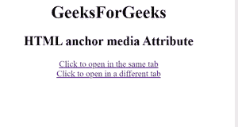

# HTML | a 媒体属性

> 原文:[https://www.geeksforgeeks.org/html-a-media-attribute/](https://www.geeksforgeeks.org/html-a-media-attribute/)

**HTML < a >媒体属性**指定链接文档优化的媒体或设备。此属性指定目标网址是为 iPhone、语音或打印媒体等设备设计的。这个属性可以接受几个值。仅当 href 属性存在时，才能使用此选项。
**可能的运算符:**

<figure class="table">

| value | describe |
| and | And operators |
| non- | Not operator |
| 、 | Or operator |

T35】</figure>

**设备:**

<figure class="table">T19】听觉 T21】语音合成器T25】盲文 T30T49】屏幕

| value | describe |
| all | Suitable for all equipment |
| Braille feedback device |
| hand-hold | Handheld device (small limited bandwidth) |
| project | projector |
| print | Print preview mode/print page |
| Computer screen |
| 电传打字机 | Teletypewriters and similar media use fixed-pitch character grids. |
| TV |

</figure>

**数值:**

<figure class="table">

| numerical value | describe |
| width | Width of the display area. |
| height | Height of target display area |
| Equipment-width | Displays the width of the target or paper. |
| Equipment-height | Displays the height of the target or paper. |
| direction | Displays the orientation of the target or paper. |
| aspect ratio | Aspect ratio of target display area. |
| Equipment width-height ratio | Device width/device height ratio of target monitor/paper. |
| colour | Target display digits of each color. |
| Color-index | The number of colors that the target display can handle. |
| monocolour | The number of bits per pixel in the monochrome frame buffer. |
| Resolution of the target/paper | Pixels per inch (dpi or dpcm). |
| scan | Scanning method of TV. |
| grid | If the output device is a grid or bitmap. |

</figure>

**注意:**可以使用**“min-****“max-**等前缀。
**例:**

## 超文本标记语言

```html
                        <html>

<head>
    <title>
        HTML anchor media Attribute
    </title>
</head>

<body>
    <h1>GeeksForGeeks</h1>
    <h2>
    HTML anchor media Attribute
</h2>
    <a href="https://ide.geeksforgeeks.org/"
    media="print and (resolution:300dpi)">
        Click to open in the same tab
    </a>
    <br>
    <a href="https://ide.geeksforgeeks.org/"
    target="_blank"
    media="print and (resolution:300dpi)">
        Click to open in a different tab
    </a>
</body>

</html>
```

\

**输出:**



**支持的浏览器:**T2 HTML<a>媒体属性支持的浏览器如下:

*   谷歌 Chrome
*   微软公司出品的 web 浏览器
*   火狐浏览器
*   苹果 Safari
*   歌剧