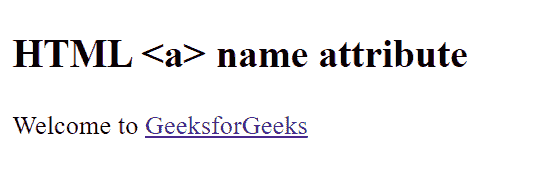

# HTML | a 名称属性

> 原文:[https://www.geeksforgeeks.org/html-a-name-attribute/](https://www.geeksforgeeks.org/html-a-name-attribute/)

**HTML 锚点名称属性**用于指定<和>元素的名称。它用于在提交表单后引用表单数据，或者引用 JavaScript 中的元素。

**语法:**

```html
<a name="name"> 
```

**属性值:**它包含一个单一的值名，该值名描述了<一个>元素的名称。

**示例:**

```html
<!DOCTYPE html>
<html>

<head>
    <title>HTML a name attribute </title>
</head>

<body>
    <h2>
        HTML <a> name attribute
    </h2>

    <p>Welcome to
        <a href="https://www.geeksforgeeks.org/"
                name="Geeks">
            GeeksforGeeks
        </a>
    </p>
</body>

</html>              
```

**输出:**


**支持的浏览器:**HTML<a>名称属性支持的浏览器如下:

*   谷歌 Chrome 1.0
*   Firefox 1.0
*   Edge 2.0
*   Opera 1.0
*   苹果 Safari 1.0