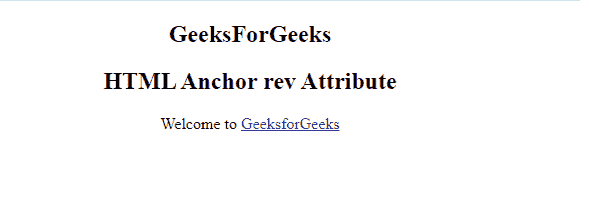

# HTML a rev 属性

> 原文:[https://www.geeksforgeeks.org/html-a-rev-attribute/](https://www.geeksforgeeks.org/html-a-rev-attribute/)

**HTML < a > rev 属性**用于定义链接文档和当前文档之间的关系。该属性与 **HTML rel 属性相反。**html 5 不支持。

**语法:**

```html
<a rev="value">
```

**属性值:**

*   **替代版本:**它定义了文档的替代版本，即打印页面、翻译或镜像。
*   **样式表:**它为文档定义一个外部表。
*   **开始:**定义选择中的第一个文档。
*   **下一步:**定义选择中的下一个文档。
*   **prev:** 定义选择中的上一个文档。
*   **目录:**定义文档的目录。
*   **索引:**定义文档的索引。
*   **词汇表:**它定义了文档中使用的单词的解释。
*   **版权:**定义包含一条版权信息的文档。
*   **章节:**指定文档的章节。
*   **节:**定义文档的一个节。
*   **子节:**指定文件的子节。
*   **附录:**规定了文件的附录。
*   **帮助:**指定帮助文档。
*   **书签:**指定相关文档。
*   **nofollow:** 它被谷歌使用，用来指定谷歌搜索蜘蛛不应该跟随那个链接，并且主要用于付费链接。
*   **许可:**定义文档的版权信息。
*   **标签:**指定当前文档的标签关键字。

**示例:**

## 超文本标记语言

```html
<!DOCTYPE html>
<html>

<body>
    <center>
    <h2>
        GeeksForGeeks
    </h2>
    <h2>
        HTML Anchor rev Attribute
    </h2>
    <p>Welcome to
        <a rev="start"
           href="https://ide.geeksforgeeks.org/">
           GeeksforGeeks
        </a>
    </p>

</body>

</html>
```

**输出:**



**支持的浏览器:**

*   谷歌 Chrome
*   微软公司出品的 web 浏览器
*   火狐浏览器
*   旅行队
*   歌剧