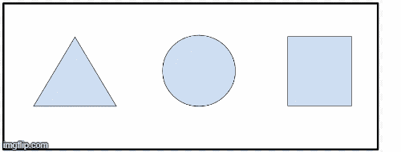

# HTML | a 形状属性

> 原文:[https://www.geeksforgeeks.org/html-a-shape-attribute/](https://www.geeksforgeeks.org/html-a-shape-attribute/)

**形状属性**与*坐标属性一起用于描述<对象>或< img >元素*中链接的大小、形状和位置。HTML 5 不支持。
**语法:**

```html
<a shape="value">
```

**属性值:**

*   **默认:**用于指定整个区域。
*   **矩形:**用于指定矩形区域。
*   **圆形:**用于指定圆形区域。
*   **多边形:**用于指定多边形区域。

**例:**

## 超文本标记语言

```html
<!DOCTYPE html>
<html>

<head>
    <title>
      HTML a shape Attribute
  </title>
</head>

<body style="text-align: center">
    <object data=
"https://media.geeksforgeeks.org/wp-content/uploads/20190227165729/area11.png"
            alt="shape"
            type="image/png"
            usemap="#shapemap">

        <map name="shapemap">
            <!-- a tag contained image. -->
            <a href=
"https://media.geeksforgeeks.org/wp-content/uploads/20190227165802/area2.png"
               shape="poly"
               coords="59, 31, 28, 83, 91, 83">
              Polynomial
          </a>

            <a href=
"https://media.geeksforgeeks.org/wp-content/uploads/20190227165934/area3.png"
               shape="circle"
               coords="155, 56, 26">
              Circle
          </a>

            <a href=
"https://media.geeksforgeeks.org/wp-content/uploads/20190227170021/area4.png"
               shape="rect"
               coords="224, 30, 276, 82">
              Rectangle
          </a>
        </map>
    </object>
</body>

</html>
```

**输出:**

**点击前具体可点击区域:**


**点击具体可点击区域后:**



**支持的浏览器:**T2 HTML<a>形状属性支持的浏览器如下:

*   火狐浏览器
*   歌剧