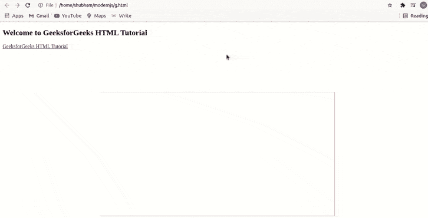
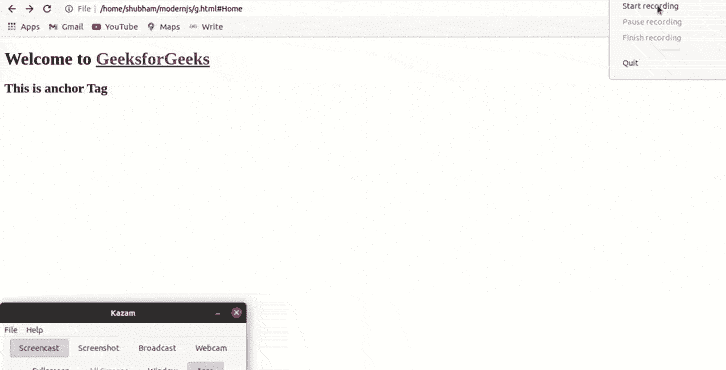
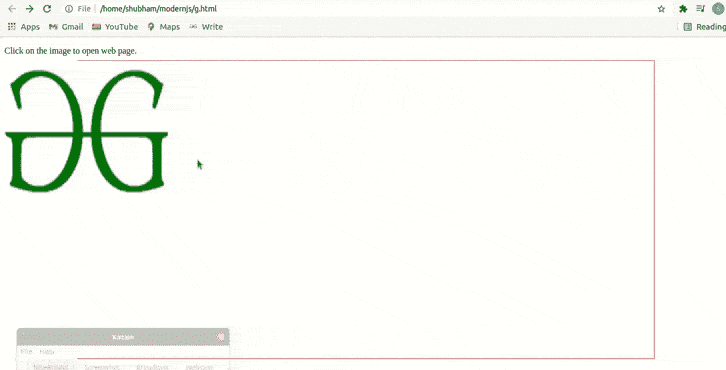

# HTML a 标签

> 原文:[https://www.geeksforgeeks.org/html-a-tag/](https://www.geeksforgeeks.org/html-a-tag/)

**示例:**在本例中，当您点击 geesforgeks HTML 教程时，将会打开 geesforgeks HTML 教程页面。

## 超文本标记语言

```html
<!DOCTYPE html>
<html>
<body>

  <h2>Welcome to GeeksforGeeks HTML Tutorial</h2>
  <a href="https://www.geeksforgeeks.org/html-tutorials/">
     GeeksforGeeks HTML Tutorial
  </a>

</body>

</html>
```

**输出:**



HTML 中的

**语法:**

```html
<a href = "link"> Link Name </a>
```

**属性:**锚点标签包含许多属性，如下所示。

*   [**HTML < a >字符集属性**](https://www.geeksforgeeks.org/html-a-charset-attribute/) **:** 该属性用于指定字符集。HTML 5 不支持。
*   [**HTML < a >下载属性**](https://www.geeksforgeeks.org/html-a-download-attribute/#:~:text=The%20download%20attribute%20is%20used,name%20of%20the%20downloaded%20file.) **:用于指定用户点击时要下载的目标链接。**
*   [**HTML<a>hre flang Attribute**](https://www.geeksforgeeks.org/html-a-hreflang-attribute/)**:**用于指定链接文档的语言。
*   [**HTML < a >媒体属性**](https://www.geeksforgeeks.org/html-a-media-attribute/) **:用于指定链接的媒体。**
*   **HTML < a >坐标属性:**用于指定链接的坐标。HTML 5 不支持。
*   [**HTML < a >名称属性**](https://www.geeksforgeeks.org/html-a-name-attribute/) **:** 用于指定主播名称。HTML 5 不支持，可以用全局 **id 属性**代替。
*   [**HTML<a>rel Attribute**](https://www.geeksforgeeks.org/html-a-rel-attribute/)**:**用于指定当前文档与链接文档的关系。
*   [**HTML < a >形状属性**](https://www.geeksforgeeks.org/html-a-shape-attribute/) **:用于指定链接的形状。HTML 5 不支持。**
*   [**HTML < a >类型属性**](https://www.geeksforgeeks.org/html-a-type-attribute/) **:用于指定链接的类型。**
*   **HTML < a >目标属性:**指定目标链接。
*   [**HTML<a>rev Attribute**](https://www.geeksforgeeks.org/html-a-rev-attribute/)**:**用于指定链接文档与当前文档的关系。HTML 5 不支持。

**示例 1:** 在本例中，我们简单地从极客页面重定向到极客页面。

## 超文本标记语言

```html
<!DOCTYPE html>
<html>

<body>
  <h1>
    Welcome to
    <a href="https://www.geeksforgeeks.org/">
      GeeksforGeeks
    </a>
  </h1>
  <h2>This is anchor Tag</h2>
</body>

</html>
```

**输出:**



**示例 2:** 在本例中，我们将使用图像重定向到 Geeksforgeeks 页面。

## 超文本标记语言

```html
<!DOCTYPE html>
<html>
<body>

  <p>Click on the image to open web page.</p>
  <!-- anchor tag starts here -->
  <a href="https://www.geeksforgeeks.org/">
    
  </a>
  <!-- anchor tag ends here -->
</body>

</html>
```

**输出:**



**支持的浏览器:**

*   谷歌 Chrome
*   微软公司出品的 web 浏览器
*   火狐浏览器
*   歌剧
*   旅行队
*   边缘