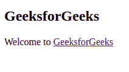

# HTML a 目标属性

> 原文:[https://www.geeksforgeeks.org/html-a-target-attribute/](https://www.geeksforgeeks.org/html-a-target-attribute/)

**示例:**在本例中，GeeksforGeeks 链接将在新选项卡中打开。

## 超文本标记语言

```html
<!DOCTYPE html>
<html>

<body>

    <h2>GeeksforGeeks</h2>
    <p>Welcome to
        <a href="https://www.geeksforgeeks.org/" 
           target="_blank">
            GeeksforGeeks
        </a>
    </p>

</body>

</html>
```

**输出:**



**HTML < a >目标属性**用于指定打开链接的位置。
**语法:**

```html
<a target="_blank | _self | _parent | _top | framename"\> 
```

**属性值:**

*   **_blank:** 在新窗口打开链接。
*   **_self:** 在同一框架中打开链接的文档。
*   **_parent:** 打开父框架集中的链接文档。
*   **_top:** 在窗口的整个正文中打开链接的文档。
*   **框架名称:**在命名框架中打开链接文档。

**示例:**本示例说明了 **< a >** 元素中目标属性的使用。

## 超文本标记语言

```html
<!DOCTYPE html>
<html>

<head>
    <title>
        HTML a target Attribute
    </title>
</head>

<body>
    <center>
        <h1>GeeksforGeeks</h1>
        <h2>HTML a Target Attribute</h2>
        <p>Welcome to
            <a href="https://ide.geeksforgeeks.org/" 
               id="GFG"
               target="_self">
                GeeksforGeeks
            </a>
        </p>

    </center>
</body>

</html>
```

**输出:**


**支持的浏览器:**

*   谷歌 Chrome
*   火狐浏览器
*   边缘 12 及以上
*   歌剧
*   苹果 Safari