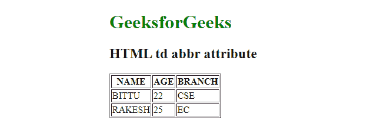

# HTML 缩写属性

> 原文:[https://www.geeksforgeeks.org/html-abbr-attribute/](https://www.geeksforgeeks.org/html-abbr-attribute/)

**缩写**属性用于指定内容的较短版本或缩写。它没有描述任何视觉效果，但被屏幕阅读器使用。

**用法**:用于[<>](https://www.geeksforgeeks.org/html-th-tag/)[<TD>](https://www.geeksforgeeks.org/html-td-tag/)标签。

缩写<第>标签中的属性:

**语法:**

```html
<th abbr="text">
```

**属性值:**

*   **文字:**包含表头单元格内容的简短描述。

**示例 1:** 下面的代码显示了如何在标题单元格中使用*缩写*属性。

## 超文本标记语言

```html
<!DOCTYPE html>
<html>

<body>
    <h1 style="color:green">GeeksforGeeks</h1>

    <h2>HTML th abbr attribute</h2>

    <table border="1">
        <tr>
            <th abbr="name of student">NAME</th>
            <th abbr="age of student">AGE</th>
            <th abbr="branch name">BRANCH</th>
        </tr>

        <tr>
            <td>BITTU</td>
            <td>22</td>
            <td>CSE</td>
        </tr>

        <tr>
            <td>RAKESH</td>
            <td>25</td>
            <td>EC</td>
        </tr>
    </table>
</body>
</html>
```

**输出:**


**缩写< td >标签中的**属性:

**语法:**

```html
<td abbr="text">
```

**属性值:**

*   **文本:**包含列单元格内容的简短描述。

**示例 2:** 下面的代码显示了如何在列单元格中使用*缩写*属性。

## 超文本标记语言

```html
<!DOCTYPE html>
<html>

<body>
    <h1 style="color:green">GeeksforGeeks</h1>

    <h2>HTML td abbr attribute</h2>

    <table border="1">
        <tr>
            <th>NAME</th>
            <th>AGE</th>
            <th>BRANCH</th>
        </tr>

        <tr>
            <td abbr="name of student">BITTU</td>
            <td abbr="age of student">22</td>
            <td abbr="branch name">CSE</td>
        </tr>

        <tr>
            <td>RAKESH</td>
            <td>25</td>
            <td>EC</td>
        </tr>
    </table>
</body>

</html>
```

**输出:**



**支持的浏览器:**HTML*缩写*属性支持的浏览器如下。

*   谷歌 Chrome
*   微软公司出品的 web 浏览器
*   火狐浏览器
*   旅行队
*   歌剧