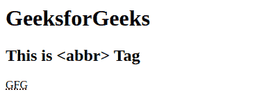

# HTML abbr 标签

> 原文:[https://www.geeksforgeeks.org/html-abbr-tag/](https://www.geeksforgeeks.org/html-abbr-tag/)

HTML 中的<abbr>标记(缩写)用于定义元素的缩写或简称。<abbr>和 [<首字母缩写>](https://www.geeksforgeeks.org/html-acronym-tag/) 标签用作缩写版本，用于表示一系列字母。缩写用于向浏览器、翻译系统和搜索引擎提供有用的信息。
**语法:**</abbr></abbr>

```html
<abbr title=""> Short form </abbr>
```

**属性:**该标签接受如上所述的可选属性，如下所述:

*   [**标题**](https://www.geeksforgeeks.org/html-title-attribute/) : 它用于指定元素的额外信息。当鼠标在元素上移动时，它显示信息。

**示例:**

## 超文本标记语言

```html
<!DOCTYPE html>
<html>

<body>
    <h1>GeeksforGeeks</h1>
    <h2>This is <abbr> Tag</h2>
    <abbr title="GeeksforGeeks">GFG</abbr>
</body>

</html>
```

**输出:**



**支持的浏览器:**

*   谷歌 Chrome
*   微软公司出品的 web 浏览器
*   火狐浏览器
*   歌剧
*   旅行队