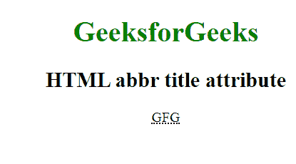

# HTML | abbr 标题属性

> 原文:[https://www.geeksforgeeks.org/html-abbr-title-attribute/](https://www.geeksforgeeks.org/html-abbr-title-attribute/)

HTML<缩写>标题属性用于指定关于元素的额外信息。当鼠标在元素上移动时，它显示信息。

**语法:**

```html
<abbr title = "text">
```

**属性值:**该属性包含单值*文本*，用作元素的工具提示文本。这个标题与所有的 HTML 元素相关联。
**例:**

```html
<!DOCTYPE html> 
<html> 
    <head> 
        <title>abbr tag</title> 
        <style> e
            body { 
                text-align:center; 
            } 
            h1 { 
                color:green; 
            } 
        </style> 
    </head> 
    <body>
        <center> 
        <h1>GeeksforGeeks</h1> 
        <h2>HTML abbr title attribute</h2> 
        <abbr title="GeeksforGeeks">GFG</abbr> 
    </center>
    </body> 
</html>                     
```

**输出:**


**支持的浏览器:**下面列出了 **HTML 缩写属性**支持的浏览器:

*   谷歌 Chrome
*   微软公司出品的 web 浏览器
*   火狐浏览器
*   歌剧
*   旅行队