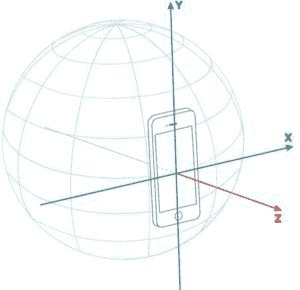
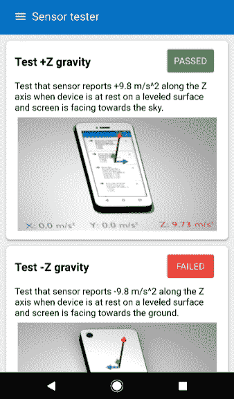
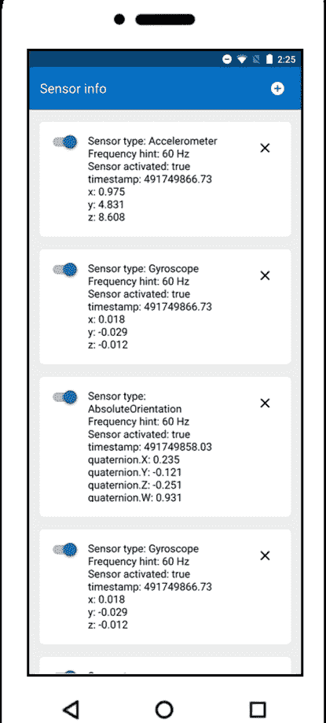

# HTML |绝对定向传感器接口

> 原文:[https://www . geeksforgeeks . org/html-absoluteorientesensor-interface/](https://www.geeksforgeeks.org/html-absoluteorientationsensor-interface/)

**绝对方位传感器:**
*绝对方位传感器*是一种融合传感器，用于测量设备相对于地球坐标系的旋转。

设备在世界坐标上的旋转基于真实的**加速度计**、**陀螺仪**和**磁力计**传感器。

**绝对方位传感器构造器:**
为了描述设备相对于地球参考坐标系的物理方位，构造器创建了一个新的**绝对方位传感器对象**

**语法:**

```html
var absoluteOrientationSensor = new AbsoluteOrientationSensor([options])
```

**参数:**
选项如下:

*   **频率:**
    每秒**传感器接通**的次数被定义为其*频率*。
    可以使用整数或十进制数，其总是小于请求的值。
*   **参考框架:**
    或者**【设备】**或者**【屏幕】**。
    默认为**【设备】**。



**属性:**
无特定属性；从其祖先**方位传感器**和**传感器**继承方法。

**基本示例:**
这个简单的演示说明了如何使用绝对方向传感器来修改三维模型的旋转四元数。该模型是一个具有四元数属性的对象三维类实例。
通用传感器验证是相对还是绝对方位传感器，并相应启动传感器。

```html
function initSensor() {
              const options = { frequency: 60, coordinateSystem };
              console.log(JSON.stringify(options));
              sensor = 
relative ? new RelativeOrientationSensor(options) : 
                  new AbsoluteOrientationSensor(options);

              sensor.onreading = 
() => model.quaternion.fromArray(sensor.quaternion).inverse();

              sensor.onerror = (event) => {
                if (event.error.name == 'NotReadableError') {
                 console.log("Sensor is not available.");
                }
              }
             sensor.start();
          }
```

**输出:**


**权限示例:**
方位传感器需要请求多个设备传感器的使用权限。**全部承诺**是请求许可所有所需传感器的好方法。

```html
const sensor = new AbsoluteOrientationSensor();
if (navigator.permissions) {
                 Promise.all(
         [navigator.permissions.query({ name: "accelerometer" }),

               navigator.permissions.query({ name: "magnetometer" }),
         navigator.permissions.query({ name: "gyroscope" })])
                      .then(results => {
                            if (results.every(
                   result => result.state === "granted")) {
                            initSensor();
                          } else {
         console.log("Permission to use sensor was denied.");
                     }
                 }).catch(err => {
           console.log("Integration with Permissions API 
is not enabled, still try to start app.");
                                initSensor();
                           });
                } else {
                    console.log(
"No Permissions API, still try to start app.");
                    initSensor();
}
```

**输出:**


**浏览器兼容性:**

*   **绝对理论传感器** 安卓T45T47】

    | 铬 | 六十九 |
    | 边缘 | <= 79 |
    | 歌剧 | 五十六 |
    | 网页浏览安卓版 | 六十九 |
    | 安卓浏览器 | 六十九 |
    | 歌剧安卓 | 四十八 |
    | 三星互联网 | 十 |

*   **绝对理论传感器()构造器**
    T26】六十九 T28T30】安卓浏览器

    | 铬 | 六十九 |
    | 边缘 | <= 79 |
    | 歌剧 | 五十六 |
    | 网页浏览安卓版 |
    | 六十九 |
    | 歌剧安卓 | 四十八 |
    | 三星互联网安卓 | 十 |