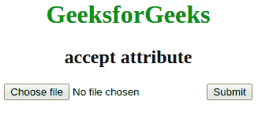

# HTML |接受属性

> 原文:[https://www.geeksforgeeks.org/html-accept-attribute/](https://www.geeksforgeeks.org/html-accept-attribute/)

此属性指定服务器接受的文件类型。该属性只能用于<input>元素。此属性不用于验证工具，因为文件上载应该在服务器上进行验证。
**语法:**

```html
<input accept = "file_extension"> 
```

**属性值**

*   **文件扩展名:**指定文件扩展名。gif，。jpg，。巴布亚新几内亚。doc)用户可以从中进行选择。
*   **音频/*:** 用户可以拾取所有声音文件。
*   **ideo/*:** 用户可以拾取所有视频文件。
*   **图像/*:** :有效媒体类型，无参数。查看 IANA 媒体类型，了解标准媒体类型的完整列表
*   **媒体类型**:无参数的有效媒体类型。

**属性:**接受属性仅与 [<输入>](https://www.geeksforgeeks.org/html-input-accept-attribute/?ref=rp) 元素相关联。
**例:**

## 超文本标记语言

```html
<!DOCTYPE html>
<html>
    <head>
        <title>accept attribute</title>
        <style>
            body {
                text-align:center;
            }
            h1 {
                color:green;
            }
        </style>
    </head>
    <body>
        <h1>GeeksforGeeks</h1>
        <h2>accept attribute</h2>
        <form action=" ">
            <input type="file" name="picture" accept="image/*">
            <input type="submit">
        </form>
    </body>
</html>                   
```

**输出:**



**支持的浏览器:**接受属性的*支持的浏览器如下:*

*   谷歌 Chrome 8.0
*   Internet Explorer 10.0
*   Firefox 4.0
*   Opera 15.0
*   苹果 Safari 6.0