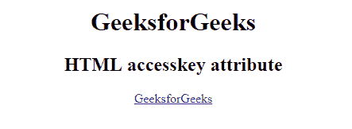
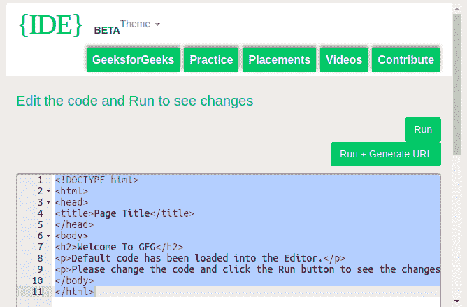

# HTML | accesskey 属性

> 原文:[https://www.geeksforgeeks.org/html-accesskey-attribute/](https://www.geeksforgeeks.org/html-accesskey-attribute/)

HTML 中的 accesskey 属性是激活/聚焦特定元素的键盘快捷键。访问键属性依赖于浏览器。它可能因浏览器而异。
**支持的标签:**支持所有 HTML 元素。

**语法:**

```html
<element accessKey = "single_character">
```

**使用访问键的快捷方式:**表中描述了使用访问键的快捷方式。

<figure class="table">T29】Alt+Shift+单 _ 字符 T50】Alt+单 _ 字符

| browser | Windows 操作系统 | 苹果个人计算机 | Linux 操作系统 |
| 谷歌铬 | Alt+single _ character | 命令+ Alt +单 _ 字符 | Alt+single _ character |
| Mozilla Firefox | Alt+Shift+single _ character |
| 微软公司出品的 web 浏览器 | Alt+ single _ character | 不适用的 | 不适用的 |
| 旅行队 | 命令+ Alt +单 _ 字符 | 不适用的 |
| 歌剧 13 |

</figure>

**注:**

*   在 HTML4.1 中，accesskey 属性只能使用很少的元素，包括
*   在 HTML5 中，accesskey 属性可以用于任何元素。

当处理多个具有相同 accesskey 的元素时，浏览器的行为会有所不同:

*   **谷歌 Chrome 和 Safari:** 带有 accesskey 的最后一个元素将被激活
*   **Opera:** 带有访问键的第一个元素将被激活
*   **Internet Explorer 和 Mozilla Firefox:** 下一个带有 accesskey 的元素将被激活

**例:**

## 超文本标记语言

```html
<!DOCTYPE html>
<html>
    <head>
        <title>
            accesskey attribute
        </title>
    </head>

    <body style = "text-align:center">
        <h1>GeeksforGeeks</h1>

        <h2>HTML accesskey attribute</h2>

        <!-- The accesskey attribute used here -->
        <a href="https://ide.geeksforgeeks.org/tryit.php"
            accesskey = "g">GeeksforGeeks
        </a>
    </body>
</html>                   
```

**输出:**
**使用访问键前:**



**使用访问键后:**



**支持的浏览器:**由 *accesskey* 属性支持的浏览器如下:

*   谷歌 Chrome
*   微软公司出品的 web 浏览器
*   火狐浏览器
*   歌剧
*   旅行队