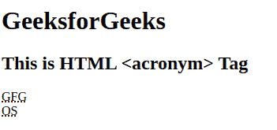

# HTML acronym 标签

> 原文:[https://www.geeksforgeeks.org/html-acronym-tag/](https://www.geeksforgeeks.org/html-acronym-tag/)

HTML 中的<acronym>标签用来定义首字母缩略词。<acronym>标签用于拼出另一个单词。它被用来给浏览器、翻译系统和搜索引擎提供有用的信息。HTML 5 不支持这个标签。</acronym></acronym>

**语法:**

```html
<acronym title=""> Short Form </acronym>
```

**属性:**该标签接受如上所述的可选属性，如下所述:

*   [**标题**](https://www.geeksforgeeks.org/html-title-attribute/) : 它用于指定元素的额外信息。当鼠标在元素上移动时，它显示信息。

**示例:**

## 超文本标记语言

```html
<!DOCTYPE html>
<html>

<body>
    <h1>GeeksforGeeks</h1>

    <h2>This is HTML <acronym> Tag</h2>

    <acronym title="GeeksforGeeks">GFG</acronym>
    <br>
    <acronym title="Operating System">OS</acronym>
</body>

</html>
```

**输出:**



**支持的浏览器:**

*   谷歌 Chrome
*   微软公司出品的 web 浏览器
*   火狐浏览器
*   歌剧
*   旅行队