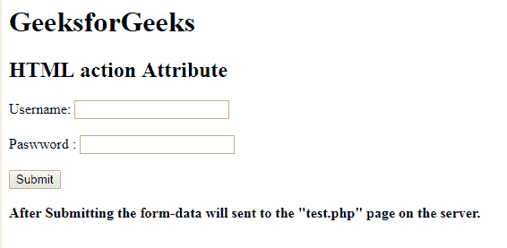

# HTML|动作属性

> 原文:[https://www.geeksforgeeks.org/html-action-attribute/](https://www.geeksforgeeks.org/html-action-attribute/)

**HTML |动作属性**用于指定表单提交后表单数据发送到服务器的位置。可以在<形态>元素中使用。
**语法:**

```html
<form action="URL">
```

**属性值:**
**URL:** 用于指定表单提交后要发送数据的文档的 URL。
网址的可能值为:

*   **绝对 URL:** 指向另一个网站链接。例如:www.gfg.org

*   **相对 URL:** 用于指向网页内的文件。例如:www.geeksforgeeks.org

**示例-1:** 本示例说明了动作属性的使用。

## 超文本标记语言

```html
<!DOCTYPE html>
<html>

<head>
    <title>
        HTML action Attribute
    </title>
</head>

<body>
    <h1>GeeksforGeeks</h1>

    <h2>HTML action Attribute</h2>

    <form action="test.php"
          method="post"
          id="users">

        <label for="username">
          Username:
      </label>
        <input type="text"
               name="username"
               id="Username">

        <br>
        <br>

        <label for="password">
          Password:
      </label>
        <input type="password"
               name="password">
    </form>

    <br>

    <button onclick="myGeeks()">
        Submit
    </button>
    <br>
    <br>
    <b>After Submitting the form-data will sent
      to the "test.php" page on the server.</b>
</body>

</html>
```

**输出:**



**支持的浏览器:***HTML 动作属性*支持的浏览器如下:

*   谷歌 Chrome
*   微软公司出品的 web 浏览器
*   火狐浏览器
*   歌剧
*   旅行队