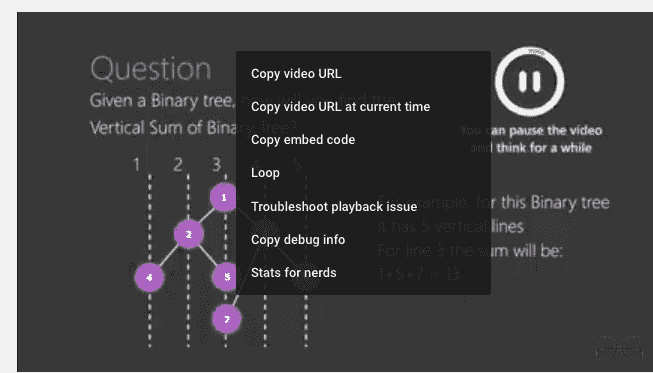
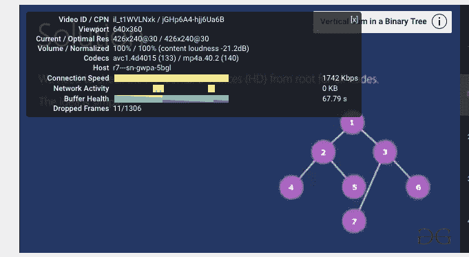

# HTML |添加 Youtube 视频

> 原文:[https://www.geeksforgeeks.org/html-adding-youtube-videos/](https://www.geeksforgeeks.org/html-adding-youtube-videos/)

在早期，向网页添加视频是一个真正的挑战，因为人们必须将视频转换成不同的格式，才能在所有浏览器中播放。将视频转换为不同的格式可能既困难又耗时。现在，向网页添加视频已经变得像复制和粘贴一样容易，而向网站添加视频的一个非常合适的解决方案是使用 Youtube。Youtube 有助于为用户托管视频，以便他们可以进一步嵌入网页。

每当保存或播放视频时，YouTube 都会显示一个类似“BGAk3_2zi8k”的 id。该 id 还被用作 youtube 视频嵌入网页的推荐。

### 在网页上添加 Youtube 视频的步骤:

1.  将您想要嵌入网页的视频上传到 YouTube 上。
2.  复制视频的视频 id。
3.  在网页中使用 iframe、object 或' embed '元素来定义视频。
4.  使用 src 属性指向视频的 URL。
5.  玩家的尺寸可以使用宽度和高度属性进行调整。

**获取 youtube 视频的视频 Id 的步骤:**

1.  打开你想要其 Id 的 youtube 视频。
2.  Right click on the video, from the menu select “Stats for nerds”.

    

3.  The first value in the box is the Video ID.

    

本视频的视频 id 为:**il _ t1WVLNxk**T2】

## 添加 Youtube 视频:

### 1)使用 iFrame 标签:

```html
<!DOCTYPE html>
<html>
<body>

<iframe height="480" width="500"  
src="https://www.youtube.com/embed/il_t1WVLNxk">
</iframe>

</body>
</html>
```

**输出:**

<video class="wp-video-shortcode" id="video-166880-1" width="450" height="376" preload="metadata" controls=""><source type="video/mp4" src="https://media.geeksforgeeks.org/wp-content/uploads/youtube.mp4?_=1">[https://media.geeksforgeeks.org/wp-content/uploads/youtube.mp4](https://media.geeksforgeeks.org/wp-content/uploads/youtube.mp4)</video>

**启用 Youtube 自动播放功能:**
当用户访问某个页面时，可以使用 YouTube 的自动播放功能自动播放视频。

可以使用两种类型的参数:

1.  值 1:当播放器加载时，视频自动开始播放。
2.  值 0(默认情况下) :当播放器加载时，视频不会自动播放。

```html
<!DOCTYPE html>
<html>
<body>

<iframe height="480" width="500"
 src="https://www.youtube.com/embed/il_t1WVLNxk?autoplay=1">
</iframe>

</body>
</html>
```

**输出:**

<video class="wp-video-shortcode" id="video-166880-2" width="450" height="376" preload="metadata" controls=""><source type="video/mp4" src="https://media.geeksforgeeks.org/wp-content/uploads/youtube.mp4?_=2">[https://media.geeksforgeeks.org/wp-content/uploads/youtube.mp4](https://media.geeksforgeeks.org/wp-content/uploads/youtube.mp4)</video>

### 创建 YouTube 播放列表:

youtube 视频的播放列表可以使用逗号字符来创建，逗号字符用于分隔要播放的视频列表。

循环参数用于循环播放视频的次数:

1.  值 1:视频将不断循环播放。
2.  值 0(默认情况下) :视频只播放一次。

```html
<!DOCTYPE html>
<html>
<body>

<iframe height="480" width="500"   
src="https://www.youtube.com/embed/il_t1WVLNxk/
           AS_dAPN1Dlk?playlist=AfxHGNRtFac&loop=1">
</iframe>

</body>
</html>
```

**输出:**

<video class="wp-video-shortcode" id="video-166880-3" width="440" height="372" preload="metadata" controls=""><source type="video/mp4" src="https://media.geeksforgeeks.org/wp-content/uploads/playlist.mp4?_=3">[https://media.geeksforgeeks.org/wp-content/uploads/playlist.mp4](https://media.geeksforgeeks.org/wp-content/uploads/playlist.mp4)</video>

### 启用/禁用 Youtube 控件:

Youtube Player 提供播放、暂停、音量等控制，可以使用控制参数禁用或启用。
有两个可用的参数:

1.  值 1(默认情况下) :显示播放器控件。
2.  值 0:不显示播放器控件。

**用于启用控制:**

```html
<!DOCTYPE html>
<html>
<body>

<iframe  width="440" height="372" 
src="https://www.youtube.com/embed/il_t1WVLNxk/?controls=1">
</iframe>

</body>
</html>
```

**输出:**

<video class="wp-video-shortcode" id="video-166880-4" width="434" height="364" preload="metadata" controls=""><source type="video/mp4" src="https://media.geeksforgeeks.org/wp-content/uploads/2.mp4?_=4">[https://media.geeksforgeeks.org/wp-content/uploads/2.mp4](https://media.geeksforgeeks.org/wp-content/uploads/2.mp4)</video>

**用于禁用控制:**

```html
<!DOCTYPE html>
<html>
<body>

<iframe  width="440" height="372" 
src="https://www.youtube.com/embed/il_t1WVLNxk/?controls=0">
</iframe>

</body>
</html>
```

**输出:**

<video class="wp-video-shortcode" id="video-166880-5" width="438" height="358" preload="metadata" controls=""><source type="video/mp4" src="https://media.geeksforgeeks.org/wp-content/uploads/1-1.mp4?_=5">[https://media.geeksforgeeks.org/wp-content/uploads/1-1.mp4](https://media.geeksforgeeks.org/wp-content/uploads/1-1.mp4)</video>

### 2)使用对象标签:

```html
<!DOCTYPE html>
<html>
<body>

<object width="480" height="500"
data="https://www.youtube.com/embed/il_t1WVLNxk">
</object>

</body>
</html>
```

**输出:**

<video class="wp-video-shortcode" id="video-166880-6" width="450" height="376" preload="metadata" controls=""><source type="video/mp4" src="https://media.geeksforgeeks.org/wp-content/uploads/youtube.mp4?_=6">[https://media.geeksforgeeks.org/wp-content/uploads/youtube.mp4](https://media.geeksforgeeks.org/wp-content/uploads/youtube.mp4)</video>

### 3)使用嵌入标签:

```html
<!DOCTYPE html>
<html>
<body>

<embed width="480" height="500"
src="https://www.youtube.com/embed/il_t1WVLNxk">

</body>
</html>
```

**输出:**

<video class="wp-video-shortcode" id="video-166880-7" width="450" height="376" preload="metadata" controls=""><source type="video/mp4" src="https://media.geeksforgeeks.org/wp-content/uploads/youtube.mp4?_=7">[https://media.geeksforgeeks.org/wp-content/uploads/youtube.mp4](https://media.geeksforgeeks.org/wp-content/uploads/youtube.mp4)</video>

**注意:**现在不欣赏对象和嵌入标签，所以建议使用 iframe 标签。