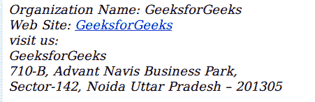

# HTML address 标签

> 原文:[https://www.geeksforgeeks.org/html-address-tag/](https://www.geeksforgeeks.org/html-address-tag/)

HTML 中的

<address>标签表示一个人或者一个组织的联系方式。如果在 [<正文>](https://www.geeksforgeeks.org/html-body-tag/) 标签内使用

<address>标签，则表示文档的联系信息；如果在 [<文章>](https://www.geeksforgeeks.org/html5-article-tag/) 标签内使用<地址>标签，则表示文章的联系信息。<地址>标签内的文本将以斜体格式显示。一些浏览器在 address 元素前后添加了换行符。</address>

</address>

**语法:**

```html
<address> Address... </address>
```

**示例:**

## 超文本标记语言

```html
<!DOCTYPE html>
<html>
<body>

     <!-- address tag starts from here -->
     <address>
         Organization Name: GeeksforGeeks <br>
         Web Site: 
         <a href=
"https://www.geeksforgeeks.org/about/contact-us/">
         GeeksforGeeks</a><br>
         visit us:<br>
         GeeksforGeeks<br>
         710-B, Advant Navis Business Park, <br>
         Sector-142, Noida Uttar Pradesh – 201305
     </address>
     <!-- address tag ends here -->

</body>
</html>                    
```

**输出:**



**支持的浏览器:**

*   谷歌 Chrome
*   微软公司出品的 web 浏览器
*   火狐浏览器
*   歌剧
*   旅行队