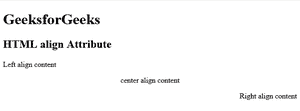
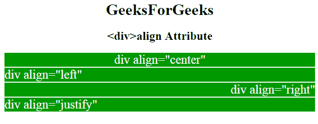

# HTML 对齐属性

> 原文:[https://www.geeksforgeeks.org/html-align-attribute/](https://www.geeksforgeeks.org/html-align-attribute/)

HTML 中的**对齐属性**用来指定元素文本内容的对齐方式。该属性用于所有元素。

**支持的标签:**

*   **<小程序>**
*   **<字幕>**
*   **<山坳>**
*   **<【colgroup】>**
*   **< hr >**
*   **< iframe >**
*   <【img】>
*   **<表>**
*   <tbody>
*   **< td >**
*   **< tfoot >**
*   **<第>**
*   **T2>和**
*   <【tr】>

**语法:**

```html
<element_name align="left | right | center | justify">
```

**属性值:**

*   **左**:设置文本左对齐。
*   **右**:设置文本右对齐。
*   **居中:**设置文本居中对齐。
*   **对齐**:拉伸段落文本，使所有行的宽度相等。

**例 1:**

## 超文本标记语言

```html
<!DOCTYPE html>
<html>

<head>
    <title>
        HTML p align Attribute
    </title>
</head>

<body>
    <h1>GeeksforGeeks</h1>

    <h2>HTML p align Attribute</h2>

    <p align="left">
    Left align content
</p>

    <p align="center">
    center align content
</p>

    <p align="right">
    Right align content
</p>

</body>

</html>
```

**输出:**



**例 2:**

## 超文本标记语言

```html
<!DOCTYPE html>
<html>

<head>
    <title>gfg</title>
    <style type=text/css>
        p {
            background-color: gray;
            margin: 10px;
        }

        div {
            color: white;
            background-color: 009900;
            margin: 2px;
            font-size: 25px;
        }

        body {
            text-align: center;
        }
    </style>

</head>

<body>
    <h1>GeeksForGeeks</h1>
    <h2><div>align Attribute</h2>
    <div align="center">
    div align="center"
</div>
    <div align="left">
    div align="left"
</div>
    <div align="right">
    div align="right"
</div>
    <div align="justify">
    div align="justify"
</div>

</body>

</html>
```

**输出:**



**支持的浏览器:**

*   谷歌 Chrome
*   微软公司出品的 web 浏览器
*   火狐浏览器
*   苹果 Safari
*   歌剧