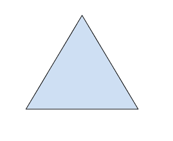

# HTML | alt 属性

> 原文:[https://www.geeksforgeeks.org/html-alt-attribute/](https://www.geeksforgeeks.org/html-alt-attribute/)

**HTML alt 属性**用于提供一个替代标记，如果主要属性< img >标记未能显示分配给它的值，则该标记用于显示或显示某些内容。
**支持标签:**

*   [区域](https://www.geeksforgeeks.org/html-area-alt-attribute/)
*   [图像](https://www.geeksforgeeks.org/html-img-alt-attribute/)
*   [输入](https://www.geeksforgeeks.org/html-input-alt-attribute/)

**属性值**:包含单值**文本**，用于指定支持元素的替代文本，如果图像未显示。

**示例:** Img alt 属性。

## 超文本标记语言

```html
<!DOCTYPE html>
<html>

<head>
    <title>
        HTML img alt Attribute
    </title>
</head>

<body>
    <h1>GeeksforGeeks</h1>

    <h2>HTML img alt Attribute</h2>

    

</body>

</html>
```

**输出:**
**前:**


**之后:**



**示例:**区域 alt 属性。

## 超文本标记语言

```html
<!DOCTYPE html>
<html>

<head>
    <title>
        HTML area alt Attribute
    </title>
</head>

<body style="text-align:center;">
    

    <map name="shapemap">

        <!-- area tag contained image. -->
        <area shape="poly" coords="59, 31, 28, 83, 91, 83" href=
"https://media.geeksforgeeks.org/wp-content/uploads/20190227165802/area2.png"
        alt="Triangle">

        <area shape="circle" coords="155, 56, 26" href=
"https://media.geeksforgeeks.org/wp-content/uploads/20190227165934/area3.png"
        alt="Circle">

        <area shape="rect" coords="224, 30, 276, 82" href=
"https://media.geeksforgeeks.org/wp-content/uploads/20190227170021/area4.png"
        alt="Square">
    </map>
</body>

</html>
```

**输出:**


**示例:**输入 alt 属性。

## 超文本标记语言

```html
<!DOCTYPE html>
<html>

<head>
    <title>
        HTML Input alt Attribute
    </title>
</head>

<body style="text-align:center;">

    <h1 style="color:green;">
            GeeksForGeeks
        </h1>

    <h2>HTML Input alt Attribute</h2>
    <input id="myImage"
        type="image"
        src=
"https://media.geeksforgeeks.org/wp-content/uploads/gfg-40.png"
        alt="Submit"
        width="48"
        height="48">
</body>

</html>
```

**输出:**


**支持的浏览器:****HTML | alt 属性**支持的浏览器如下:

*   谷歌 Chrome
*   微软公司出品的 web 浏览器
*   火狐浏览器
*   苹果 Safari
*   歌剧