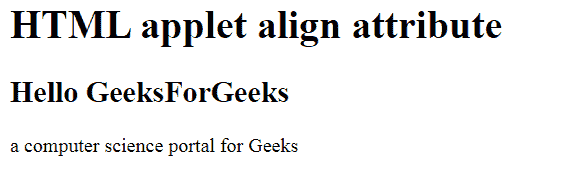

# HTML |小程序对齐属性

> 原文:[https://www.geeksforgeeks.org/html-applet-align-attribute/](https://www.geeksforgeeks.org/html-applet-align-attribute/)

**HTML 小程序对齐属性**用于指定 **<小程序>** 元素或小程序元素内部内容的对齐方式。

**语法:**

```html
<applet align="left | right | center | justify";>
```

**属性值:**

*   **左:**将内容设置为左对齐。
*   **右:**将内容设置为右对齐。
*   **居中:**我把内容元素设置到了中心。
*   **对齐:**将内容设置到对齐位置。

**示例:**

```html
<!DOCTYPE html>
<html>

<head>
    <title>
        HTML | applet align Attribute
    </title>        
</head>

<body>
    <applet code="HelloWorld" alt="GeeksForGeeKs"
            align="right" width=200 height=60
            name="geeks"> 
    </applet>

    <h1>
        HTML applet align attribute
    </h1>

    <h2>Hello GeeksForGeeks</h2>

    <p>
        a computer science
        portal for Geeks 
    </p>
</body> 

</html>          
```

**输出:**


**支持的浏览器:**HTML 小程序 align 属性支持的浏览器如下:

*   火狐浏览器
*   旅行队