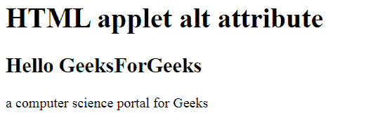

# HTML |小程序 alt 属性

> 原文:[https://www.geeksforgeeks.org/html-applet-alt-attribute/](https://www.geeksforgeeks.org/html-applet-alt-attribute/)

**HTML 小程序 alt 属性**用于指定小程序元素的替代文本。当 applet 元素不显示时，它很有用。它用于为 applet 元素提供替代信息。

**语法:**

```html
<applet alt="text">
```

**属性值:**它包含单值文本，指定小程序元素的替代文本。

**示例:**

```html
<!DOCTYPE html>
<html>

<head>
    <title>
        HTML applet alt attribute
    </title>
</head>

<body>
    <applet code="HelloWorld" alt="GeeksForGeeKs"
            width=200 height=60 name="geeks"> 
    </applet> 

    <h1>
        HTML applet alt attribute
    </h1>

    <h2>Hello GeeksForGeeks</h2>

    <p>
        a computer science
        portal for Geeks 
    </p>
</body> 

</html>  
```

**输出:**


**支持的浏览器:**HTML 小程序 alt 属性支持的浏览器如下:

*   火狐浏览器
*   旅行队