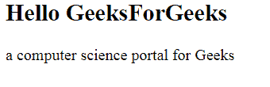

# HTML |小程序高度属性

> 原文:[https://www.geeksforgeeks.org/html-applet-height-attribute/](https://www.geeksforgeeks.org/html-applet-height-attribute/)

**HTML 小程序高度属性**用于指定<小程序>元素的高度。

**语法:**

```html
<applet height="pixels">
```

**属性值:**

*   **像素:**指定小程序元素的高度。

**示例:**

```html
<!DOCTYPE html>
<html>

<head>
    <title>
        HTML | applet height attribute
    </title>
</head>

<body>
    <applet code="HelloWorld"
        width=200 height=60>
    </applet>

    <h2>
        Hello GeeksForGeeks
    </h2>

    <p>
        a computer science
        portal for Geeks 
    </p>
</body> 

</html>    
```

在上面的代码中，applet 文件 HelloWorld 可以作为变量名消息来访问存储在其中的值，这就是“HelloWorld”。

**输出:**


**支持的浏览器:**HTML 小程序高度属性支持的浏览器如下:

*   火狐浏览器
*   旅行队