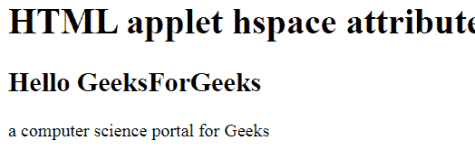

# HTML |小程序 hspace 属性

> 原文:[https://www.geeksforgeeks.org/html-applet-hspace-attribute/](https://www.geeksforgeeks.org/html-applet-hspace-attribute/)

**HTML 小程序 hspace 属性**用于指定小程序元素左侧和右侧的空白数量。

**语法:**

```html
<applet hspace="pixels">
```

**属性值:**

*   **像素:**以像素为单位指定小程序左右空白的数量。

**示例:**

```html
<!DOCTYPE html>
<html>

<head>
    <title>
        HTML | applet hspace attribute
    </title>
</head>

<body>
    <applet code="HelloWorld" alt="GeeksForGeeKs"
            align="right" vspace="hspace = "60""
            width=200 height=60 name="geeks"vs+p> 
    </applet>

    <h1>
        HTML applet hspace attribute
    </h1>

    <h2>Hello GeeksForGeeks</h2>

    <p>
        a computer science
        portal for Geeks 
    </p>
</body> 

</html>
```

**输出:**


**支持的浏览器:**HTML 小程序 hspace 属性支持的浏览器如下:

*   火狐浏览器
*   旅行队