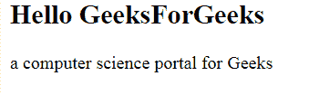

# HTML |小程序名称属性

> 原文:[https://www.geeksforgeeks.org/html-applet-name-attribute/](https://www.geeksforgeeks.org/html-applet-name-attribute/)

**HTML |小程序名称属性**用于指定一个<小程序>元素的名称。

**语法:**

```html
<applet name="name">
```

**属性值:**它包含描述小程序元素名称的单个值名称。

**示例:**

```html
<!DOCTYPE html>
<html>

<head>
    <title>
        HTML | applet name attribute
    </title>
</head>

<body>
    <applet code="HelloWorld"
            width=200
            height=60
            name="geeks"> 
    </applet> 

    <h2>
        Hello GeeksForGeeks
    </h2>

    <p>
        a computer science portal for Geeks 
    </p>
</body> 

</html>          
```

**输出:**


**支持的浏览器:**HTML 小程序名称属性支持的浏览器如下:

*   火狐浏览器
*   旅行队