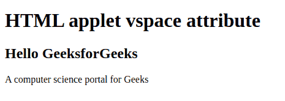

# HTML | applet vspace 属性

> 原文:[https://www.geeksforgeeks.org/html-applet-vspace-attribute/](https://www.geeksforgeeks.org/html-applet-vspace-attribute/)

**小程序 vspace 属性**用于指定小程序元素底部和顶部的空白数量。

**语法:**

```html
<applet vspace="pixels">
```

**属性值:**

*   **像素:**以像素为单位指定小程序元素顶部和底部的空白数量。

下面的例子说明了 **HTML 小程序 vspace 属性**。

*   **例:**

    ```html
    <!DOCTYPE html>
    <html>
    <head>
        <title>
            HTML | applet vspace attribute
        </title>
    </head>

    <body>
        <applet code="HelloWorld" 
                alt="GeeksforGeeKs" 
                vspace=60  
                width=200 height="60" 
                name="geeks">

        <h1>HTML applet vspace attribute</h1>

        <h2>Hello GeeksforGeeks</h2>

        <p>
            A computer science portal for Geeks
        </p>
        </applet>
    </body>

    </html>     
    ```

*   **输出:** 

**支持的浏览器:****HTML 小程序 vspace 属性**支持的浏览器如下:

*   火狐浏览器
*   旅行队