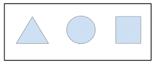

# HTML | 媒体属性

> 原文:[https://www.geeksforgeeks.org/html-area-media-attribute/](https://www.geeksforgeeks.org/html-area-media-attribute/)

HTML 区域媒体属性用于指定目标网址优化的媒体或设备。
该属性指定样式是用于特定设备，如打印媒体或语音。这个属性可以接受几个值。仅当 href 属性存在时使用。这个属性纯粹是咨询。
**语法:**

```html
<area media="value">
```

**可能的运算符:**

<figure class="table">

| value | describe |
| and | And operators |
| fault | Is not an operator |
| 、 | Or operator |

T32】</figure>

**设备:**

<figure class="table">T19】听觉 T21】语音合成器T25】盲文 T30T49】屏幕

| value | describe |
| all | Suitable for all equipment |
| Braille feedback device |
| hand-hold | Handheld device (small limited bandwidth) |
| project | projector |
| print | Print preview mode/print page |
| Computer screen |
| 电传打字机 | Teletypewriters and similar media use fixed-pitch character grids. |
| TV |

</figure>

**价值观:**

<figure class="table">

| 价值 | 描述 |
| 宽度 | 目标显示区域的宽度。 |
| 高度 | 目标显示区域的高度 |
| 设备宽度 | 目标显示或纸张宽度。 |
| 设备高度 | 目标显示或纸张高度。 |
| 方向 | 目标显示或纸张方向。 |
| 纵横比 | 目标显示区域的宽高比。 |
| 设备纵横比 | 目标显示器/纸张的设备宽度/设备高度比。 |
| 颜色 | 目标显示器每种颜色的位数。 |
| 颜色指数 | 目标显示器可以处理的颜色数量。 |
| 黑白的 | 单色帧缓冲区中的每像素位数。 |
| 解决 | 目标显示器/纸张的像素密度(dpi 或 dpcm)。 |
| 扫描 | 电视显示器的扫描方法。 |
| 格子 | 如果输出设备是网格或位图。 |

</figure>

**注意:**可以使用**“min-****“max-**等前缀。
**例:**

## 超文本标记语言

```html
<!DOCTYPE html>
<html>

<head>
    <title>
        HTML area rel Attribute
    </title>
</head>

<body style="text-align:center;">
    

    <map name="shapemap">

        <!-- area tag contained image. -->
        <area shape="poly"
              coords="59, 31, 28, 83, 91, 83"
              href=
"https://media.geeksforgeeks.org/wp-content/uploads/20190227165802/area2.png"
              alt="Triangle"
              rel="alternate"
              media="screen and (min-color-index:256)">

        <area shape="circle"
              coords="155, 56, 26"
              href=
"https://media.geeksforgeeks.org/wp-content/uploads/20190227165934/area3.png"
              alt="Circle"
              rel="alternate">

        <area shape="rect"
              coords="224, 30, 276, 82"
              href=
"https://media.geeksforgeeks.org/wp-content/uploads/20190227170021/area4.png"
              alt="Square"
              rel="alternate">
    </map>
</body>

</html>
```

输出:

**点击特定可点击区域前**



**点击具体可点击区域后**


**支持的浏览器:****HTML 区域媒体属性**支持的浏览器如下:

*   谷歌 Chrome
*   微软公司出品的 web 浏览器
*   火狐浏览器
*   苹果 Safari
*   歌剧