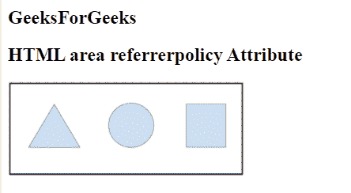

# HTML 引用者策略属性

> 原文:[https://www . geesforgeks . org/html-area-referer policy-attribute/](https://www.geeksforgeeks.org/html-area-referrerpolicy-attribute/)

**HTML <区域> referrerpolicy 属性**用于指定客户端的引用信息，在取出结果时会发送给服务器。

**语法:**

```html
<area referrerpolicy="value">
```

**属性值:**

*   **无引用者:**指定不会随请求发送引用信息。
*   **降级时无推荐人**:有默认值。它指定引用头将不会发送到没有 HTTPS 的源。
*   **来源:**指定在所有情况下只发送文档的来源作为推荐人。
*   **原点-当-跨原点:**执行同原点请求时发送原点、路径、查询字符串，其他情况只发送单据的原点。
*   **同源:**指定将为同站点源发送推荐人，但跨源请求将不发送推荐人信息。
*   **严格-起源-何时-跨起源:**它在执行同起源请求时发送起源、路径和查询字符串，在执行跨起源请求时仅在协议安全级别保持不变时才发送起源(HTTPS/HTTPS)，不发送报头到任何不太安全的目的地(HTTPS/HTTP)。
*   **unsafe-url:** 它发送一个原点、路径和查询字符串作为参考信息，但不包括密码和用户名。

**示例:**

## 超文本标记语言

```html
<!DOCTYPE html>
<html>

<body>
    <h2>
        GeeksForGeeks
    </h2>

    <h2>
        HTML area referrerpolicy Attribute
    </h2>

    

    <map name="shapemap">
        <!-- area tag contained image. -->
        <area shape="poly"
            coords="59,31,28,83,91,83"
            href=
"https://media.geeksforgeeks.org/wp-content/uploads/20190227165802/area2.png"
            alt="Triangle" referrerpolicy="same-origin">

        <area shape="circle"
            coords="155,56,26"
            href=
"https://media.geeksforgeeks.org/wp-content/uploads/20190227165934/area3.png"
            alt="Circle" referrerpolicy="same-origin">

        <area shape="rect"
            coords="224,30,276,82"
            href=
"https://media.geeksforgeeks.org/wp-content/uploads/20190227170021/area4.png"
            alt="Square" referrerpolicy="same-origin">
    </map>
</body>

</html>
```

**输出:**



**支持的浏览器:**

*   谷歌 Chrome
*   微软公司出品的 web 浏览器
*   Mozilla Firefox
*   歌剧
*   旅行队