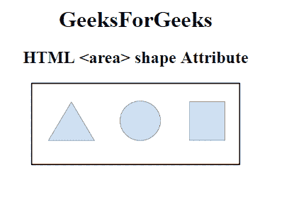

# HTML | 形状属性

> 原文:[https://www.geeksforgeeks.org/html-area-shape-attribute/](https://www.geeksforgeeks.org/html-area-shape-attribute/)

**HTML 区域形状属性**与坐标属性一起用于描述 **<区域>** 元素的大小、形状和位置。

**语法:**

```html
<area shape="default | rect | circle | poly">
```

**属性值:**

*   **默认:**用于指定整个区域。
*   **矩形:**用于指定矩形区域。
*   **圆形:**用于指定圆形区域。
*   **多边形:**用于指定多边形区域。

**示例:**

## 超文本标记语言

```html
<!DOCTYPE html>
<html>

<head>
    <title>
        HTML area shape Attribute
    </title>
</head>

<body style="text-align:center;">
    <h1>
        GeeksForGeeks
    </h1>
    <h2>
          HTML <area> shape Attribute
    </h2>
    

    <map name="shapemap">

        <!-- area tag contained image. -->
        <area shape="poly"
              coords="59, 31, 28, 83, 91, 83"
              href=
"https://media.geeksforgeeks.org/wp-content/uploads/20190227165802/area2.png"
              alt="Triangle">

        <area shape="circle"
              coords="155, 56, 26"
              href=
"https://media.geeksforgeeks.org/wp-content/uploads/20190227165934/area3.png"
              alt="Circle">

        <area shape="rect"
              coords="224, 30, 276, 82"
              href=
"https://media.geeksforgeeks.org/wp-content/uploads/20190227170021/area4.png"
              alt="Square">
    </map>
</body>

</html>
```

**输出:**

**之前点击具体区域:**



**点击具体区域后:**


**支持的浏览器:****HTML 区域形状属性**支持的浏览器如下:

*   谷歌 Chrome
*   微软公司出品的 web 浏览器
*   火狐浏览器
*   苹果 Safari
*   歌剧