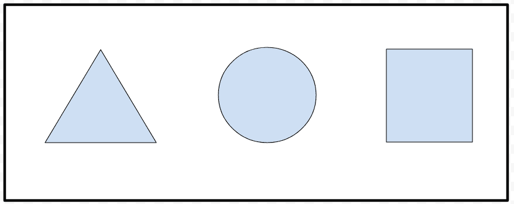
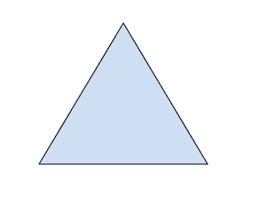

# HTML 标签

> 原文:[https://www.geeksforgeeks.org/html-area-tag/](https://www.geeksforgeeks.org/html-area-tag/)

这个标签在 HTML 文档中用于映射图像的一部分，使其可被最终用户点击。它用于在用户点击图像的**映射部分**后，指引用户到不同的链接。它被用作 [**<地图>**](https://www.geeksforgeeks.org/html-map-tag/) 标签的子标签。它没有结束标记，因此对于 HTML 来说它是一个空标记，但是在 XHTML 的情况下，您需要正确地关闭它。HTML5 有一些新的属性。

**语法:**

```html
<area>
```

**属性:**该标签接受如下所述的大量属性。

*   [**形状**](https://www.geeksforgeeks.org/html-shape-attribute/) **:** 要映射到图像上的形状，可以是“矩形”、“圆形”或“多边形”。
*   [**坐标**](https://www.geeksforgeeks.org/html-coords-attribute/) **:** 形状的坐标。
*   [**href**](https://www.geeksforgeeks.org/html-link-href-attribute/)**:****href 是点击图像的映射部分后用户将被定向到的链接。**
*   **[**alt**](https://www.geeksforgeeks.org/html-alt-attribute/) **:** 图像地图中可点击区域的替代文本。**
*   **[**下载**](https://www.geeksforgeeks.org/html-download-attribute/) **:点击超链接时**下载目标。**
*   **[**目标**](https://www.geeksforgeeks.org/html-target-attribute/) **:** 打开链接资源的上下文。**
*   **[**hre flang**](https://www.geeksforgeeks.org/html-hreflang-attribute/)**:**目标网址的语言。**
*   **[**媒体**](https://www.geeksforgeeks.org/html-media-attribute/) **:** 针对媒体或设备的优化 URL。**
*   **[**rel**](https://www.geeksforgeeks.org/html-rel-attribute/)**:**URL 与文档的关系。**
*   **[**类型**](https://www.geeksforgeeks.org/html-type-attribute/) **:** 媒体类型的 URL**

****示例:**html 中的<区域>标签。**

## **超文本标记语言**

```html
<!DOCTYPE html>
<html>

<body>
    

    <map name="shapemap"> 
        <!-- area tag contained image. -->
        <area shape="poly"
            coords="59,31,28,83,91,83"
            href= 
"https://media.geeksforgeeks.org/wp-content/uploads/20190227165802/area2.png"
            alt="Triangle"> 

        <area shape="circle"
            coords="155,56,26"
            href= 
"https://media.geeksforgeeks.org/wp-content/uploads/20190227165934/area3.png"
            alt="Circle"> 

        <area shape="rect"
            coords="224,30,276,82"
            href= 
"https://media.geeksforgeeks.org/wp-content/uploads/20190227170021/area4.png"
            alt="Square"> 
    </map>
</body>

</html>
```

****输出:****

*   **在点击特定可点击区域之前**

****

*   **点击特定的可点击区域后**

****

****注意:**该<区域>标签始终嵌套在<地图>标签中。
**支持的浏览器:****

*   **谷歌 Chrome**
*   **微软公司出品的 web 浏览器**
*   **Mozilla Firefox**
*   **歌剧**
*   **旅行队**