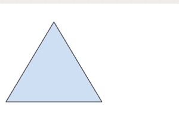

# HTML | 目标属性

> 原文:[https://www.geeksforgeeks.org/html-area-target-attribute/](https://www.geeksforgeeks.org/html-area-target-attribute/)

**HTML <区域>目标属性**用于指定打开链接文档的位置。它只在 href 属性出现在区域元素中时有效。

**语法:**

```html
<area target="_blank|_self|_parent|_top|framename"> 
```

**属性值:**

*   **_blank:** 在新窗口打开链接。
*   **_self:** 在同一框架中打开链接的文档。
*   **_parent:** 打开父框架集中的链接文档。
*   **_top:** 在窗口的整个正文中打开链接的文档。
*   **框架名称:**在命名框架中打开链接文档。

**示例:**本示例说明了区域元素中目标属性的使用。

## 超文本标记语言

```html
<!DOCTYPE html>
<html>

<head>
    <title>
        HTML area target Attribute
    </title>
</head>

<body style="text-align:center;">

    <h1 style="color:green;">GeeksForGeeks</h1>

    <h2>HTML <area> Target Attribute</h2>

    

    <map name="shapemap">

        <!-- area tag contained image. -->
        <area shape="poly" coords="59, 31, 28, 83, 91, 83"
href="https://media.geeksforgeeks.org/wp-content/uploads/20190227165802/area2.png"
            alt="Triangle" target="_self">

        <area shape="circle" coords="155, 56, 26"
href="https://media.geeksforgeeks.org/wp-content/uploads/20190227165934/area3.png"
            alt="Circle" target="_blank">

        <area shape="rect" coords="224, 30, 276, 82"
href="https://media.geeksforgeeks.org/wp-content/uploads/20190227170021/area4.png"
            alt="Square" target="_parent">
    </map>
</body>

</html>                                   
```

**输出:**


**点击特定区域后:**



**支持的浏览器:***HTML 区域目标属性*支持的浏览器如下:

*   谷歌 Chrome
*   微软公司出品的 web 浏览器
*   火狐浏览器
*   旅行队
*   歌剧