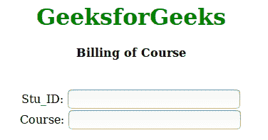
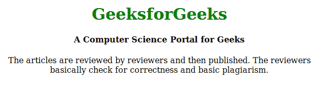
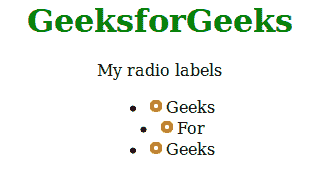

# HTML | aria-labelledby 属性

> 原文:[https://www . geesforgeks . org/html-aria-labelledby-attribute/](https://www.geeksforgeeks.org/html-aria-labelledby-attribute/)

**aria-labelledby** 属性是 HTML 中的一个内置属性，用于创建对象及其标签之间的关系。当任何元素同时包含属性 **aria-labelledby** 和[T5】aria-label](https://www.geeksforgeeks.org/html-aria-label-attribute/)属性时，浏览器的高优先级毫无疑问将是 **aria-labelledby** 。这个 aria-labelledby 属性可以用于任何典型的 HTML 表单元素；它不局限于元素而是 **aria-label** 属性我们在使用 aria-label 的时候要小心，因为它并不适用于所有的 HTML 元素。

**语法:**

```
<element aria-labelledby =""> Content </element >
```

**参数:**所有元素标识的空格分隔列表。

下面是 aria-labelledby 属性的所有流行用法列表:

*   **多个标签:**这里每个元素都是一个包含标签、单个标签和组标签的字段。
    T3】例:

## 超文本标记语言

```
<!DOCTYPE html>
<html>

<head>
    <style>
        body {
            text-align: center;
        }

        h1 {
            color: green;
        }
    </style>
</head>

<body>
    <h1>GeeksforGeeks</h1>
    <div id="myBillingId"><h4>Billing of Course</h4></div>
    <br>
    <div>
        <div id="myNameId">Stu_ID:
            <input type="text"
                   aria-labelledby="myBillingId myNameId" />
        </div>
    </div>
    <div>
        <div id="myCourseId">Course:
            <input type="text"
                   aria-labelledby="myBillingId myCourseId" />
        </div>
    </div>
</body>

</html>
```

**输出:**



*   **将标题与区域相关联:**在本例中，标题元素与组头 div 相关联，这使得组头和标题元素之间的关系。
    T3】例:

## 超文本标记语言

```
<!DOCTYPE html>
<html>

<head>
    <style>
        body {
            text-align: center;
        }

        h1 {
            color: green;
        }
    </style>
</head>

<body>

    <div role="main" aria-labelledby="geeks">
        <h1>GeeksforGeeks</h1>
        <h4 id="geeks">A Computer Science Portal for Geeks</h4>
      The articles are reviewed by reviewers and then published.
      The reviewers basically check for correctness and basic
      plagiarism.
    </div>
</body>

</html>
```

**输出:**



*   **单选组:**在本例中，按钮的单选组与容器头相关。
    T3】例:

## 超文本标记语言

```
<!DOCTYPE html>
<html>

<head>
    <style>
        body {
            text-align: center;
        }

        h1 {
            color: green;
        }
    </style>
</head>

<body>
    <h1>GeeksforGeeks</h1>
    <div id="radio_label">My radio labels</div>
    <ul role="radiogroup" aria-labelledby="radio_label">
        <li role="radio">
            <input type="radio">Geeks</li>
        <li role="radio">
            <input type="radio">For</li>
        <li role="radio">
            <input type="radio">Geeks</li>
    </ul>
</body>

</html>
```

**输出:**



*   **对话框标签:**在本例中，对话框和标题元素之间建立了关系。
    T3】例:

## 超文本标记语言

```
<div role="dialog" aria-labelledby="dialogheader">
    <dialog id="dialogheader">Choose a File</dialog>
    A Computer Science Portal
</div>
```

*   **内联定义:**在下面的示例中，在叙述的自然流程中描述的术语的定义使用 aria-labelledby 属性与术语本身相关联。
    T3】例:

## 超文本标记语言

```
<p>The articles are reviewed by reviewers and then 
    <dfn id="placebo">placebo</dfn>, published.
      <span role="definition" aria-labelledby="placebo"> 
The reviewers basically check for correctness and basic plagiarism.</span>
</p>
```

*   **定义列表:**在下面的示例中，正式定义列表中的定义与它们使用 aria-labelledby 属性定义的术语相关联。
    T3】例:

## 超文本标记语言

```
<dl>
    <dt id="Geeks">Geeks</dt>
    <dd role="definition" aria-labelledby="Geeks">
      The articles are reviewed by reviewers and then published.
    </dd>
    <dd role="definition" aria-labelledby="Geeks">
      The reviewers basically check for correctness and basic plagiarism.
    </dd>

    <dt id="GFG">GfG</dt>
    <dd role="definition" aria-labelledby="GFG">
      The articles are reviewed by reviewers and then published.
    </dd>
    <dd role="definition" aria-labelledby="GFG">
      The reviewers basically check for correctness and basic plagiarism.
    </dd>
</dl>
```

*   **菜单:**在下面的示例中，使用 aria-labelledby 属性
    将弹出菜单与其标签相关联**示例:**

## 超文本标记语言

```
<div role="menubar">
    <div role="menuitem" aria-haspopup="true" id="fileMenu">File</div>
    <div role="menu" aria-labelledby="fileMenu">
        <div role="menuitem">GeeksforGeeks</div>
        <div role="menuitem">Courses</div>
    </div>
</div>
```