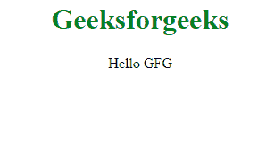

# HTML |异步属性

> 原文:[https://www.geeksforgeeks.org/html-async-attribute/](https://www.geeksforgeeks.org/html-async-attribute/)

**HTML 异步属性**是一个布尔属性。如果存在，它指定脚本在可用时异步执行。此属性仅适用于外部脚本(并且仅在存在 src 属性时使用)。
**注:**外部脚本执行方式太多了:

*   当 async 存在时:脚本与页面的其余部分异步执行(脚本将在页面继续解析时执行)
*   当 async 不存在并且 defer 存在时:当页面完成解析时执行脚本
*   如果异步或延迟都不存在:在浏览器继续解析页面之前，立即提取并执行脚本

**语法:**

```html
<script async>
```

**适用:**

*   [**<剧本>**](https://www.geeksforgeeks.org/html-script-async-attribute/?ref=rp)

**例:**Index.html

## 超文本标记语言

```html
<!DOCTYPE html>
<html>

<body>
    <center>
        <h1 style="color:green">
          Geeksforgeeks
      </h1>
        <p id="p1">Hello GFG</p>

        <script src="geeks.js" async></script>
    </center>
</body>

</html>
```

**极客**T2】

## java 描述语言

```html
alert("Hello GFG"); 
```

**输出:**



**支持的浏览器:****HTML 异步属性**支持的浏览器如下

*   谷歌 Chrome 4.0
*   Firefox 4.0
*   苹果 Safari 4.0
*   歌剧 10.5
*   边缘