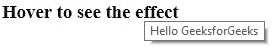

# HTML |属性

> 原文:[https://www.geeksforgeeks.org/html-attributes/](https://www.geeksforgeeks.org/html-attributes/)

属性用于提供关于元素的额外信息。

*   所有的 HTML 元素都可以有属性。属性提供关于元素的附加信息。
*   它需要两个参数:**一个名称和一个值。**这些定义了元素的属性，并放置在元素的开始标记内。name 参数采用我们希望分配给元素的属性的名称，该值采用属性的值或属性名称的范围，这些属性名称可以在元素上对齐。
*   每个名字都有一些必须用引号括起来的价值。

[HTML 属性完整参考](https://www.geeksforgeeks.org/html-attributes-complete-reference/)

**语法:**

```html
<element attribute_name="attribute_value">

```

以下是 HTML 中最常用的一些属性:

1.  **src 属性:**如果我们想在网页中插入图片，那么我们需要使用< img >标签和 src 属性。我们需要将图像的地址指定为双引号内的属性值。

    ## 超文本标记语言

    ```html
    <html>
    <head>
        <title>src Attribute</title>
    </head>
    <body>
        
    </body>
    </html>
    ```

    **输出** :
    
2.  **alt Attribute :** 顾名思义，这是一个备用标签，用于在主要属性(即< img >标签)无法显示分配给它的值时显示或显示某些内容。这也可以用来向实际上坐在编码端的开发人员描述图像。

    ## 超文本标记语言

    ```html
    <html>
    <head>
        <title>alt Attribute</title>
    </head>
    <body>
        <!--If the image is not found or the img field 
         is left blank the alt value gets displayed-->
        <br>
        
    </body>
    </html>
    ```

    **输出** :
    
3.  **宽度和高度属性:**该属性用于调整图像的宽度和高度。
    **示例** :

    ## 超文本标记语言

    ```html
    <html>
    <head>
        <title>Width and Height</title>
    </head>
    <body>
        
    </body>
    </html>
    ```

    **输出** :
    
4.  **id 属性:**该属性用于为元素提供唯一的标识。当我们需要访问一个与其他元素名称相似的特定元素时，可能会出现这种情况。在这种情况下，我们为不同的元素提供不同的 id，以便它们可以被唯一地访问。扩展 id 使用的属性通常用在 CSS 中，我们将在后面学习。

    ## 超文本标记语言

    ```html
    <html>
    <head>
        <title>id Attribute</title>
    </head>
    <body>
        <p id = "GfG">Hello geeks<br>
        <p id = "ui">This is unique to this paragraph<br>
        <p id = "head">This is also unique to this paragraph
    </body>
    </html>
    ```

5.  **标题属性:**标题属性用于解释鼠标悬停在其上的元素。不同元素的行为不同，但通常在加载或鼠标指针悬停在值上时显示该值。
    **示例** :

    ## 超文本标记语言

    ```html
    <html> 
    <head> 
        <title>title Attribute</title> 
    </head> 
    <body> 
        <h3 title="Hello GeeksforGeeks">Hover to see the effect</h3> 
    </body> 
    </html>                    
    ```

    **输出** :
    
6.  **href 属性:**该属性用于指定任何地址的链接。该属性与 **<和>** 标签一起使用。放在 href 属性中的链接链接到< a >标签中显示的文本。
    点击文本后，我们将被重定向到该链接。默认情况下，链接在同一个标签中打开，但是通过使用**目标**属性并将其值设置为**“_ blank”**，我们将根据浏览器配置被重定向到另一个选项卡或另一个窗口。

    ## 超文本标记语言

    ```html
    <html>
    <head>
        <title>link Attribute</title>
    </head>
    <body>
        <a href="https://www.geeksforgeeks.org/">
            Click to open in the same tab
        </a><br>
        <a href="https://www.geeksforgeeks.org/" target="_blank">
            Click to open in a different tab
        </a>
    </body>
    </html>
    ```

    **输出** :
    
7.  **样式属性:**该属性用于为 HTML 元素提供各种 CSS(层叠样式表)效果，如增加字体大小、改变字体系列、着色等。有关详细解释，请参考 HTML |样式标签。下面的程序显示了几个符合样式属性

    ## 的名称和值超文本标记语言

    ```html
    <html>
    <head>
        <title>style Attribute</title>
    </head>
    <body>
        <h2 style="font-family:Chaparral Pro Light;">Hello GeeksforGeeks.</h2>
        <h3 style="font-size:20px;">Hello GeeksforGeeks.</h3>
        <h2 style="color:#8CCEF9;">Hello GeeksforGeeks.</h2>
        <h2 style="text-align:center;">Hello GeeksforGeeks.</h2>
    </body>
    </html>
    ```

    **输出** :
    
8.  **语言属性:**语言是用语言属性声明的。对于辅助功能应用程序和搜索引擎来说，声明语言是很重要的。

    ## 超文本标记语言

    ```html
    <!DOCTYPE html>
    <html lang="en-US">
    <body>

    ...

    </body>
    </html>
    ```

本文由 [**【钦莫伊蕾恩卡】**](https://www.linkedin.com/in/lenkachinmoy/) 供稿。如果你喜欢 GeeksforGeeks 并想投稿，你也可以使用[write.geeksforgeeks.org](https://write.geeksforgeeks.org)写一篇文章或者把你的文章邮寄到 review-team@geeksforgeeks.org。看到你的文章出现在极客博客主页上，帮助其他极客。

如果你发现任何不正确的地方，或者你想分享更多关于上面讨论的话题的信息，请写评论。