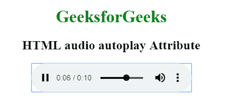

# HTML | audio 自动播放属性

> 原文:[https://www . geesforgeks . org/html-audio-autoplay-attribute/](https://www.geeksforgeeks.org/html-audio-autoplay-attribute/)

**HTML <音频>自动播放属性**用于指定音频一加载就自动开始播放。它是一个布尔属性。

**语法:**

```html
<audio autoplay>
```

以下示例说明了 HTML 中的

<audio>自动播放属性:</audio>

**示例:**

```html
<!DOCTYPE html> 
<html> 

<head> 
    <title> 
        HTML audio autoplay Attribute
    </title> 
</head> 

<body style="text-align: center"> 

    <h1 style="color: green"> 
        GeeksforGeeks 
    </h1> 

    <h2>HTML audio autoplay Attribute</h2> 

    <audio controls autoplay> 
        <source src="GFG.ogg" type="audio/ogg"> 
        <source src="GFG.mp3" type="audio/mpeg"> 
    </audio> 
</body> 

</html>                    
```

**输出:**


**支持的浏览器:**HTML 音频自动播放属性支持的浏览器如下:

*   谷歌 Chrome 4.0
*   Internet Explorer 9.0
*   Firefox 3.5
*   Safari 4.0
*   歌剧 10.5