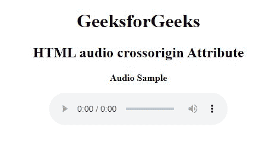

# HTML audio 跨原点属性

> 原文:[https://www . geesforgeks . org/html-audio-cross origin-attribute/](https://www.geeksforgeeks.org/html-audio-crossorigin-attribute/)

当我们试图从第三方服务器或另一个域获取音频文件时，HTML crossorigin 属性用于支持 CORS 请求的

<audio>元素。</audio>

**语法:**

```html
<audio crossorigin="anonymous | use-credentials">
```

**属性值:**

*   **匿名:**有默认值。它定义了在不传递凭据信息的情况下发送 CORS 请求。
*   **使用-凭证:**跨来源请求将与凭证、cookies 和证书一起发送。

**示例**:下面的代码说明了<音频>元素中的 crossorigin 属性的使用。它被设置为“匿名”值，在不传递凭证信息的情况下检索音频文件。

## 超文本标记语言

```html
<!DOCTYPE html>
<html>

<head>
    <title>HTML audio crossorigin Attribute</title>
</head>

<body>
    <center>
        <h1>GeeksforGeeks</h1>
        <h2>HTML audio crossorigin Attribute</h2>
        <b>
            <p>Audio Sample</p>
        </b>

        <!-- Use of crossorigin Attribute in audio element -->
        <audio crossorigin="anonymous" controls>
            <source src="test.mp3" type="audio/mp3" />
            <source src="test.ogg" type="audio/ogg" />
        </audio>
    </center>
</body>

</html>
```

**输出:**



**支持的浏览器:**

*   谷歌 Chrome 94.0 及以上
*   火狐 92.0 及以上版本
*   微软边缘 93.0
*   Opera 79.0