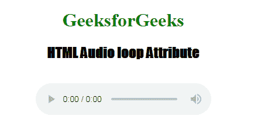

# HTML | audio 循环属性

> 原文:[https://www.geeksforgeeks.org/html-audio-loop-attribute/](https://www.geeksforgeeks.org/html-audio-loop-attribute/)

**HTML <音频>循环属性**用于加载网页后反复重启音频。它包含布尔值。这个标签在 HTML 5 中是新的。

**语法:**

```html
<audio loop>
```

**示例:**

```html
<!DOCTYPE html>
<html>

<head>
    <title>
        HTML Audio loop Attribute
    </title>
</head>

<body style="text-align: center">

    <h1 style="color: green"> 
        GeeksforGeeks 
    </h1>
    <h2 style="font-family: Impact"> 
        HTML Audio loop Attribute 
    </h2>
    <br>

    <audio id="Test_Audio" controls loop>
        <source src=
"https://media.geeksforgeeks.org/wp-content/uploads/20190531165842/Recording1514.ogg" 
                        type="audio/ogg">

        <source src=
"https://media.geeksforgeeks.org/wp-content/uploads/20190531165842/Recording1514.mp3" 
                        type="audio/mpeg">
    </audio>
</body>

</html>
```

**输出:**


**支持的浏览器:**HTML<音频>循环属性支持的浏览器如下:

*   谷歌 Chrome 4.0
*   Internet Explorer 9.0
*   Firefox 11.0
*   Safari 4.0
*   歌剧 10.5