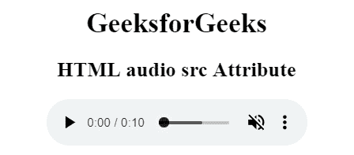

# HTML | audio src 属性

> 原文:[https://www.geeksforgeeks.org/html-audio-src-attribute/](https://www.geeksforgeeks.org/html-audio-src-attribute/)

**HTML <音频> src 属性**用于指定音频文件的 URL。我们应该使用 Mp3 文件在互联网浏览器和 Safari 浏览器中播放音频。源元素可用于向网页添加音频文件，以便在所有浏览器中工作。

**语法:**

```html
<audio src="URL">
```

**属性值:**包含单值网址，指定音频文件的网址。下面列出了两种类型的网址链接:

*   **绝对 URL:** 指向另一个网页。
*   **相对 URL:** 指向同一网页的其他文件。

下面的例子说明了 HTML 中的

<audio>src 属性:</audio>

**示例:**

```html
<!DOCTYPE html> 
<html> 

<head>
    <title>
        HTML audio src Attribute
    </title>
</head>

<body style="text-align:center;"> 

    <h1>GeeksforGeeks</h1>

    <h2>
        HTML audio src Attribute
    </h2>

    <audio controls muted> 
        <source src="GFG.mp3" type="audio/mp3"> 
        <source src="GFG.ogg" type="audio/ogg"> 
    </audio> 
</body> 

</html>                    
```

**输出:**


**支持的浏览器:**HTML<音频> src 属性支持的浏览器如下:

*   谷歌 Chrome
*   微软公司出品的 web 浏览器
*   火狐浏览器
*   旅行队
*   歌剧