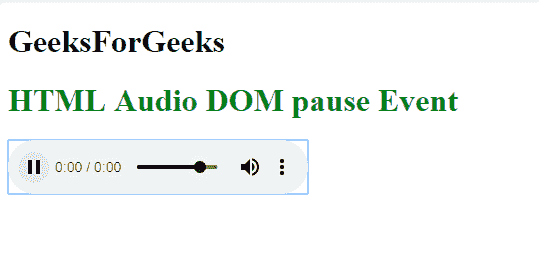
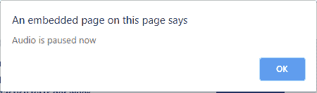

# HTML |音频/视频 DOM 暂停事件

> 原文:[https://www . geesforgeks . org/html-audio-video-DOM-pause-event/](https://www.geeksforgeeks.org/html-audio-video-dom-pause-event/)

**HTML 音频/视频 DOM 暂停事件**发生在用户暂停音频时，或者它将自动暂停或停止。

**语法:**

*   **这个语法在 HTML 中使用**

    ```html
    <audio|video onpause="myScript">
    ```

*   **此语法用于 JavaScript:**

    ```html
    audio|video.onpause=function(){myScript}; 
    ```

*   **在 JavaScript 中，我们还使用了 addEventListener()方法:**

    ```html
    audio|video.addEventListener("pause", myScript); 
    ```

**示例:**

```html
<!DOCTYPE html>
<html>

<head>
    <title>
        HTML Audio/Video DOM pause Event
    </title>
</head>

<body>
    <h1>
        GeeksForGeeks
    </h1>
    <h1 style="color:green">
      HTML Audio DOM pause Event
  </h1>
    <audio id="geeks" 
           controls>
        <source src="beep.mp3"
                type="audio/mp3">
    </audio>
    <script>
        var aud =
            document.getElementById("geeks");
        aud.onpause = function() {
            alert("Audio is paused now");
        };
    </script>
</body>

</html>
```

**输出:**
**前:**


**之后:**


**支持的浏览器:****音视频 DOM 暂停事件**支持的浏览器如下:

*   谷歌 Chrome
*   Internet Explorer 9.0
*   火狐浏览器
*   苹果 Safari
*   歌剧