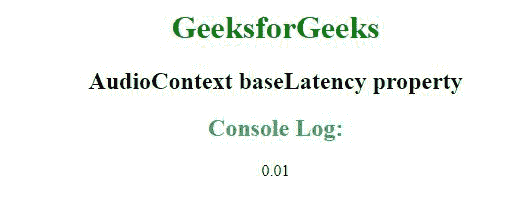
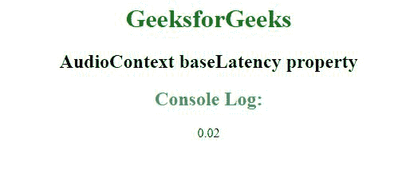

# HTML |音频上下文基线属性

> 原文:[https://www . geeksforgeeks . org/html-audio context-baseltency-property/](https://www.geeksforgeeks.org/html-audiocontext-baselatency-property/)

**先决条件:** [***音频上下文输出延迟属性***](https://www.geeksforgeeks.org/web-audio-api-audiocontext-outputlatency-property/)

音频上下文接口中的**基线**只读属性用于表示音频上下文从音频目标节点传递音频缓冲区所导致的处理延迟秒数

**语法:**

```html
var Latency = audioCtx.baseLatency;
```

**返回值:**

```html
A double value is returned in seconds.
```

**例 1:**

```html
<!DOCTYPE html> 
<html> 
<head> 
    <title> 
        AudioContext baseLatency property 
    </title> 
</head> 

<body style="text-align:center;">
    <center> 
        <h1 style="color:green"> 
        GeeksforGeeks 
        </h1> 
        <h2>AudioContext baseLatency property</h2> 
        <script> 
        const laten1 = new AudioContext();
        console.log(laten1.baseLatency); 
        </script> 
    </center> 
</body> 

</html>
```

**输出:**



**例 2:**

```html
<!DOCTYPE html> 
<html> 
<head> 
    <title> 
        AudioContext baseLatency property 
    </title> 
</head> 

<body style="text-align:center;">
    <center> 
        <h1 style="color:green"> 
        GeeksforGeeks 
        </h1> 
        <h2>AudioContext baseLatency property</h2> 
        <script> 
        const laten2 = new AudioContext({ latencyHint: 'playback' });
        console.log(laten2.baseLatency);
        </script> 
    </center> 
</body> 

</html> 
```

**输出:**



**支持的浏览器:**以下列出了 *HTML 音频上下文基线属性*支持的浏览器:

*   谷歌 Chrome
*   边缘
*   火狐浏览器
*   歌剧