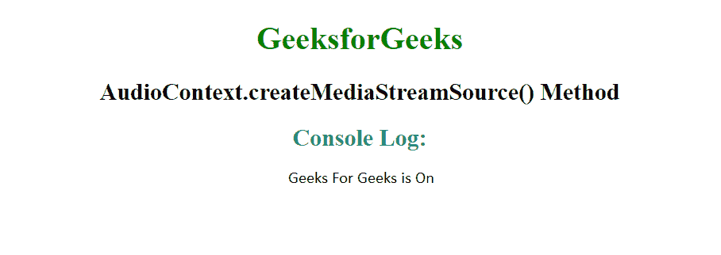
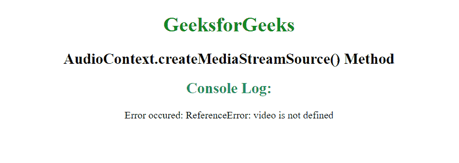

# HTML 音频上下文 createMediaStreamTrackSource()方法

> 原文:[https://www . geesforgeks . org/html-audio context-createmediastreamtrack source-method/](https://www.geeksforgeeks.org/html-audiocontext-createmediastreamtracksource-method/)

**先决条件:** [**音频上下文基线属性**](https://www.geeksforgeeks.org/html-audiocontext-baselatency-property/)

HTML audio context . createmediastreamtracksource()用于创建 MediaStreamAudioSourceNode 对象的实例，用户可以使用该实例在
audio context . createmediastreamtracksource()方法中操纵流提要。媒体流音频源节点用于音频处理图形的使用和操作。

**语法:**

```html
audioSourceNode = audioContext.createMediaStreamSource(stream)

```

**参数:**该方法接受单参数**流**，该流保存媒体流(流)作为音频源。

**返回值:**这个方法返回 MediaStreamAudioSourceNode 对象。

**示例:**

## 超文本标记语言

```html
<!DOCTYPE html>
<html>

<body style="text-align:center;">
    <center>
        <h1 style="color:green">
            GeeksforGeeks
        </h1>
        <h2>AudioContext.createMediaStreamSource() Method</h2>
        <script>
            navigator.mediaDevices.getUserMedia(
                { audio: true, video: true })
                .then(function (stream) {
                    video.srcObject = stream;

                    // Create a MediaStreamAudioSourceNode
                    // Feed the HTMLMediaElement into it
                    var audioCtx = new AudioContext();
                    var source = audioCtx
                        .createMediaStreamSource(stream);

                    if (source)
                        console.log('Geeks For Geeks is On');
                })
                .catch(function (err) {
                    console.log('Error occured: ' + err);
                });
        </script>
    </center>
</body>

</html>
```

**输出:**



**当出现一些错误时**



**说明:**在这个例子中，我们从 navigator.getUserMedia 中抓取一个媒体(音频+视频)流，将该媒体馈送到一个视频元素中播放，然后将音频静音，但也将音频馈送到一个 MediaStreamAudioSourceNode 中。

**支持的浏览器:**

*   谷歌 Chrome
*   微软边缘
*   火狐浏览器
*   歌剧
*   狩猎