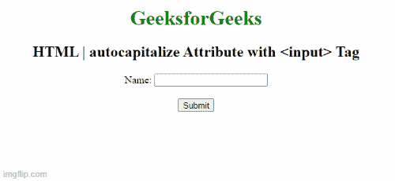

# HTML 自动沉淀属性

> 原文:[https://www . geesforgeks . org/html-auto capitalize-attribute/](https://www.geeksforgeeks.org/html-autocapitalize-attribute/)

**HTML 自动大写属性**用于定义 HTML 元素内部存在的文本是否应该自动大写。它是一个全局属性，意味着它应用于所有的 HTML 元素。

**特征:**

*   它指定文本将如何自动大写。
*   它表示单词或句子的第一个字母是大写的。
*   它不支持带有网址、电子邮件和密码类型的<input>标签。
*   它是一个全局属性。

**语法:**

```html
<tag_name autocapitalize="off | none | on 
          | sentences | words | characters" />
```

**属性值:**

*   **关/无:**定义文本不大写。
*   **on/句子:**定义每个句子的第一个字母为大写。
*   **单词:**定义每个单词的第一个字母为大写。
*   **字符:**指定整篇文字大写。

**示例:**在 HTML 代码下面，使用带有<输入>标签的自动大写属性。

## 超文本标记语言

```html
<!DOCTYPE html>
<html>

<head>
    <title>
        HTML | autocapitalize Attribute
      <input>
    </title>
</head>

<body style="text-align:center">

    <h1 style="color: green;">
        GeeksforGeeks
    </h1>

    <h2>
        HTML | autocapitalize Attribute 
        with <input> Tag
    </h2> 

    Name:
    <input type="text" autocapitalize="words" autofocus>
    <br><br>

    <!-- Assign id to the Button. -->
    <button id="GFG">
        Submit
    </button>
    <br>
</body>

</html>
```

**输出:**



**重要提示:**此代码在移动设备和语音输入等虚拟键盘上工作。它不适用于物理键盘。

**支持的浏览器:**

*   谷歌 Chrome 43.0
*   苹果 Safari 5.0