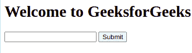
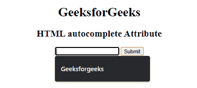

# HTML 自动完成属性

> 原文:[https://www.geeksforgeeks.org/html-autocomplete-attribute/](https://www.geeksforgeeks.org/html-autocomplete-attribute/)

**示例:**在本例中，我们在表单中使用自动完成属性值作为 off。

## 超文本标记语言

```html
<!DOCTYPE html>
<html>
<body>

    <h1>Welcome to GeeksforGeeks</h1>
    <form id="myGeeks">
        <input type="text"
               autocomplete="off"
               id="text_id"
               name="fname">
        <input type="submit">

    </form>

</body>

</html>
```

**输出:**



**HTML 自动完成属性**用于*指定输入字段已经自动完成是打开还是关闭*。当浏览器上的自动完成属性设置为时，将自动完成用户之前输入的值。它可以处理许多输入字段，如文本、搜索、网址、电子邮件、密码、日期选择器、范围和颜色。

**语法:**

```html
<element autocomplete="on | off"> 
```

**属性值:**

*   上的**:指定启用自动完成。**
*   **关闭**:指定自动完成被禁用。

**适用:**适用的自动完成属性。

*   [**HTML 表单自动完成属性**](https://www.geeksforgeeks.org/html-form-autocomplete-attribute/) **:用于指定表单有自动完成开或关值。**
*   [**HTML 输入自动完成属性**](https://www.geeksforgeeks.org/html-input-autocomplete-attribute/) **:用于指定输入有自动完成开或关值。**
*   [**HTML 选择自动完成属性**](https://www.geeksforgeeks.org/html-select-autocomplete-attribute/) **:用于指定选择有自动完成开或关值。**
*   [**HTML 文本区自动完成属性**](https://www.geeksforgeeks.org/html-textarea-autocomplete-attribute/) **:用于指定文本区有自动完成开或关值。**
*   [**HTML 字段集自动完成属性**](https://www.geeksforgeeks.org/html-fieldset-autocomplete-attribute/) **:** 用于指定字段集的自动完成开或关值。

**示例:**本示例说明了自动完成属性在输入元素中的使用:

## 超文本标记语言

```html
<!DOCTYPE html>
<html>

<head>
  <title>HTML autocomplete Attribute</title>
</head>

<body style="text-align:center;">

  <h1>GeeksforGeeks</h1>

  <h2>
    HTML autocomplete Attribute
  </h2>
  <form id="myGeeks">
    <input type="text"
           autocomplete="on"
           id="text_id"
           name="fname">

    <input type="submit">
  </form>

</body>

</html>
```

**输出:**



**支持的浏览器:**

*   谷歌 Chrome
*   Firefox 67 及以上版本
*   边缘 79 及以上
*   歌剧
*   苹果 Safari