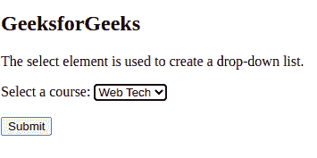
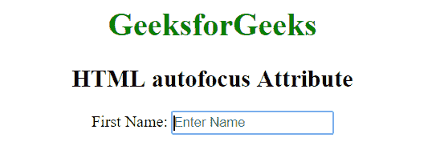
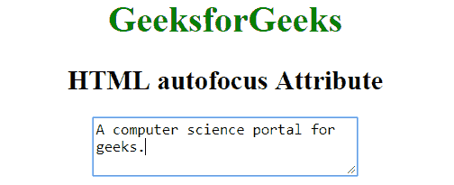

# HTML 自动对焦属性

> 原文:[https://www.geeksforgeeks.org/html-autofocus-attribute/](https://www.geeksforgeeks.org/html-autofocus-attribute/)

**示例:**在本例中，我们使用了选择自动对焦属性，该属性为 GeeksforGeeks 课程创建了下拉列表。

## 超文本标记语言

```html
<!DOCTYPE html>
<html>

<body>

  <h2>GeeksforGeeks</h2>

  <p>
    The select element is used to create a drop-down list.
  </p>

  <form>
    <label for="courses">Select a course:</label>
    <select name="DSA Self Paced GfG"
            id="DSA">
      <option value="Full Stack Web Technology">
        Web Tech
      </option>
      <option value="Amazon Interview Preparation">
        Amazon
      </option>
      <option value="Complete Interview Preparation">
        CIP
      </option>
      <option value="Google Test Series">
        GTS
      </option>
    </select>
    <br><br>
    <input type="submit" value="Submit">
  </form>

</body>

</html>
```

**输出:**



HTML 中的自动聚焦属性用于指定页面加载时元素应该获得焦点。它是一个布尔属性。
**注意:**只支持以下元素:<按钮>、<输入>、<选择>和<文本区>

**支持的标签:**

*   [按钮自动对焦属性](https://www.geeksforgeeks.org/html-button-autofocus-attribute/)
*   [输入自动对焦属性](https://www.geeksforgeeks.org/html-input-autofocus-attribute/)
*   [Keygen 自动对焦属性](https://www.geeksforgeeks.org/html-keygen-autofocus-attribute/)
*   [选择自动对焦属性](https://www.geeksforgeeks.org/html-select-autofocus-attribute/)
*   [文本区自动对焦属性](https://www.geeksforgeeks.org/html-textarea-autofocus-attribute/)

**语法:**

```html
<elementName autofocus>
```

**例 1:**

## 超文本标记语言

```html
<!DOCTYPE html>
<html>

<head>
  <title>HTML autofocus Attribute</title>
</head>

<body style="text-align: center;">
  <h1 style="color: green;">GeeksforGeeks</h1>
  <h2>HTML autofocus Attribute</h2>
  <form>
    <label>First Name:
      <input type="text" autofocus placeholder="Enter Name">
    </label>
  </form>
</body>

</html>
```

**输出:**



**例 2:**

## 超文本标记语言

```html
<!DOCTYPE html>
<html>

<head>
  <title>HTML autofocus Attribute</title>
</head>

<body style="text-align: center;">
  <h1 style="color: green;">GeeksforGeeks</h1>
  <h2>HTML autofocus Attribute</h2>
  <textarea rows="3" cols="30" autofocus>
            A computer science portal for geeks.
        </textarea>
</body>

</html>
```

**输出:**



**支持的浏览器:**

*   谷歌 Chrome 5.0
*   Internet Explorer 10.0
*   Firefox 4.0
*   歌剧 9.6
*   苹果 Safari 5.0