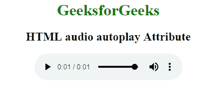

# HTML |自动播放属性

> 原文:[https://www.geeksforgeeks.org/html-autoplay-attribute/](https://www.geeksforgeeks.org/html-autoplay-attribute/)

**HTML 自动播放属性**用于指定加载网页时音频/视频应自动开始播放。它是一个布尔属性。
**语法:**

```html
<element autoplay> 
```

**使用**可以搭配 [<音频>](https://www.geeksforgeeks.org/html-audio-autoplay-attribute/?ref=rp) 和 [<视频>](https://www.geeksforgeeks.org/html-video-autoplay-attribute/?ref=rp) 元素使用。
**示例 1:** 这里自动播放属性与 [<视频>](https://www.geeksforgeeks.org/html-video-autoplay-attribute/?ref=rp) 标签一起使用。

## 超文本标记语言

```html
<!DOCTYPE html>
<html>

<head>
    <title>HTML video autoplay Attribute</title>
</head>

<body>
    <center>
        <h1 style="color:green;">GeeksforGeeks</h1>

        <h3>HTML video autoplay Attribute</h3>

        <video width="400" height="200" controls autoplay>
            <source src=
"https://media.geeksforgeeks.org/wp-content/uploads/20190616234019/Canvas.move_.mp4"
                    type="video/mp4">
            <source src=
"https://media.geeksforgeeks.org/wp-content/uploads/20190616234019/Canvas.move_.ogg"
                    type="video/ogg">
        </video>
    </center>
</body>

</html>
```

**输出:**


**示例 2:** 这里自动播放属性与 [<音频>](https://www.geeksforgeeks.org/html-audio-autoplay-attribute/?ref=rp) 标签一起使用。

## 超文本标记语言

```html
<!DOCTYPE html>
<html>

<head>
    <title>
        HTML audio autoplay Attribute
    </title>
</head>

<body style="text-align: center">

    <h1 style="color: green">
        GeeksforGeeks
    </h1>

    <h2>HTML audio autoplay Attribute</h2>

    <audio controls autoplay>
        <source src=
"https://media.geeksforgeeks.org/wp-content/uploads/20190531165842/Recording1514.ogg"
                        type="audio/ogg">
        <source src=
"https://media.geeksforgeeks.org/wp-content/uploads/20190531165842/Recording1514.mp3"
                    type=" audio/mpeg ">
    </audio>
</body>

</html>       
```

**输出:**



**支持的浏览器:**HTML 自动播放属性支持的浏览器如下:

*   谷歌 Chrome 4.0
*   Internet Explorer 9.0
*   Firefox 3.5
*   Safari 4.0
*   歌剧 10.5